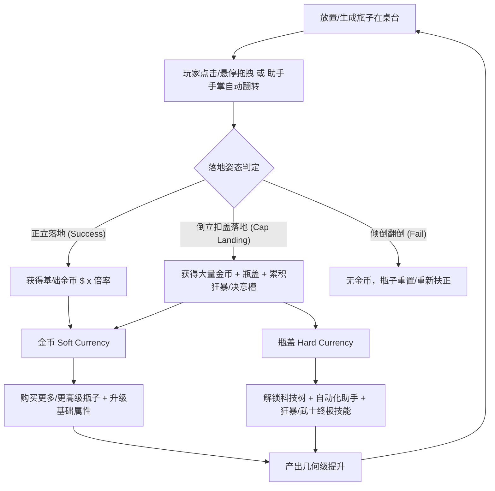
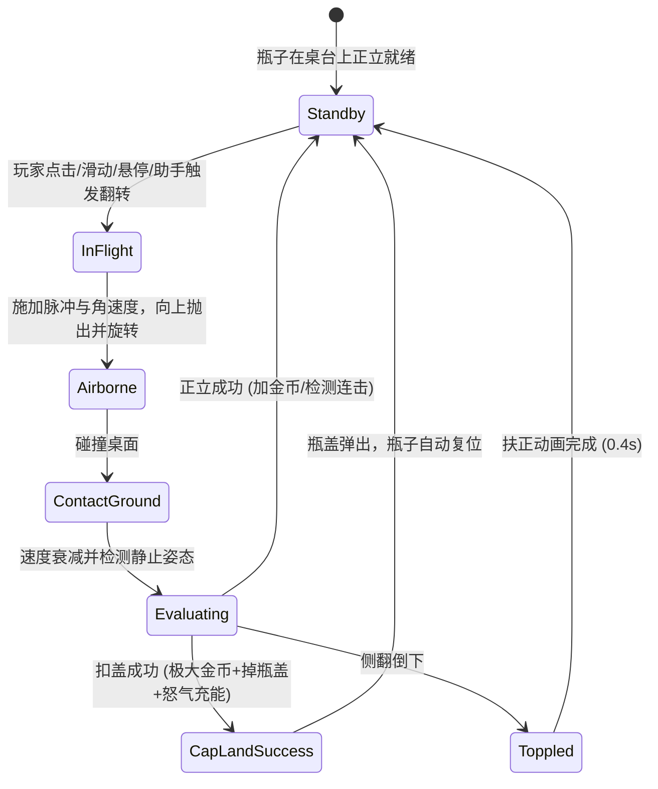
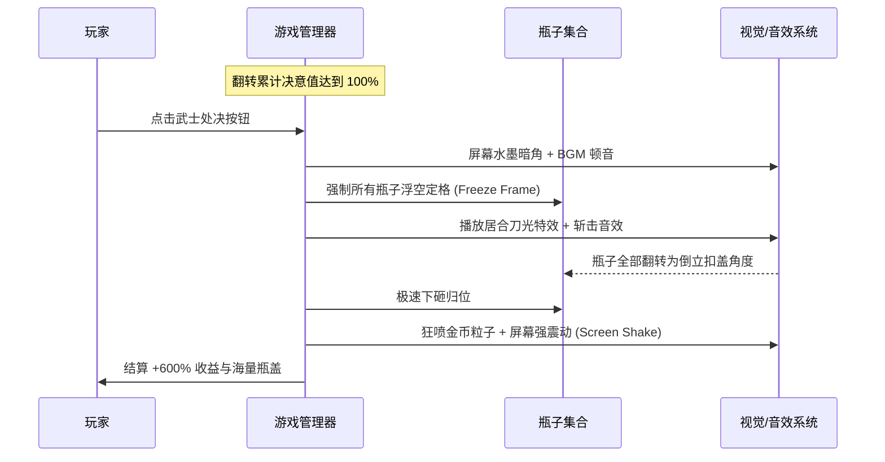

# 《Bottle Flip Inc.》（瓶子翻转公司）100% 竖屏复刻策划方案 (GDD)
> **版本号**：v1.0.0  
> **文档性质**：工业级独立策划与技术落地规范（单一真理源，持续迭代）  
> **目标引擎**：Cocos Creator 3.8.8 (TypeScript)  
> **适配方向**：移动端竖屏 (Portrait) 适配（标准设计分辨率 `720 × 1280` / `1080 × 1920`）  
> **原版工程来源**：Unity 2022.3+ IL2CPP 独立包体反编译与资源提取解析  

---

## 目录
1. [原版工程逆向框架分析 (Reverse Engineering & Architecture)](#1-原版工程逆向框架分析)
2. [竖屏复刻整体定位与适配规范 (Portrait Adaptation & Specifications)](#2-竖屏复刻整体定位与适配规范)
3. [核心玩法与物理判定机制 (Core Mechanics & Physics)](#3-核心玩法与物理判定机制)
4. [游戏经济与七阶瓶子体系 (Economy & 7 Bottle Tiers)](#4-游戏经济与七阶瓶子体系)
5. [四大技能树与三大终极机制 (Skill Trees & Special Mechanics)](#5-四大技能树与三大终极机制)
6. [助手系统与自动化挂机 (Helper Hands & Automation)](#6-助手系统与自动化挂机)
7. [竖屏 UI 架构与线框布局 (Portrait UI Layout & Wireframes)](#7-竖屏-ui-架构与线框布局)
8. [视听资产与 Cocos 3.8.8 资源映射 (Asset Mapping)](#8-视听资产与-cocos-388-资源映射)
9. [Cocos Creator 3.8.8 技术架构与脚本落地指南 (Technical Architecture)](#9-cocos-creator-388-技术架构与脚本落地指南)
10. [边缘异常与容灾机制 (Edge Cases & Exception Handling)](#10-边缘异常与容灾机制)
11. [版本迭代与里程碑规划 (Roadmap & Milestones)](#11-版本迭代与里程碑规划)

---

## 1. 原版工程逆向框架分析

通过对原工程 `Bottle Flip Inc Demo` 的资产包（`sharedassets1.assets`、`resources.assets`、`StreamingAssets/aa` Addressables 本地化包）以及 IL2CPP 元数据（`global-metadata.dat`）的底层解析，提炼出原游戏的完整模块与架构体系：

### 1.1 核心脚本模块划分（原 `06_Scripts` 逆向清单）
原工程采用模块化解耦设计，核心脚本分为 6 大领域：
- **数据层 (Data & SO)**：
  - `GameData`, `Data`, `GlobalVariable`：全局运行时与持久化根数据。
  - `BottleData`, `BottleRuntimeData`, `BottleStatData`, `BottleSaveData`：瓶子静态规格、运行时属性与存档。
  - `PlayerData`, `PlayerRuntimeData`, `PlayerSaveData`：玩家光标范围、挂机收益、传送带等级。
  - `HelperData`, `HelperRuntimeData`, `HelperHandData`：助手手掌数量、移动速度、抓取冷却。
  - `AbilityData`, `AbilitySaveData`：技能状态（飞天可乐、狂暴、武士处决）。
  - `UpgradeStatData`, `MachineSpeedData`, `AreaSizeBuyableLimitData`：数值公式与购买上限限制。
  - `AchievementData`, `AchievementSO`：成就配置与完成条件。
- **游戏逻辑层 (Gameplay)**：
  - `BottleFlip.cs`, `BottleFlipCollider.cs`, `MatchCircleCollider.cs`：瓶子旋转物理、底部吸附、着陆角度判定（正立/倒立扣盖/倒地倾覆）。
  - `BottleCap.cs`, `ICapGate.cs`, `MachineGate.cs`：瓶盖弹射、收集、传送带闸门翻倍过滤。
  - `MachineController.cs`, `CapMachineUnlockController.cs`：瓶盖机传送带控制器。
  - `BottleAreaFlipper.cs`, `AreaProjectile.cs`：光标范围悬停翻转判定。
  - `HelperMovement.cs`, `HelperHandSpawner.cs`：自动化助手手掌寻路、伸缩、点击翻转。
  - `FlyingCoke.cs`, `FlyingCokeSpawner.cs`：随机横穿屏幕的飞天可乐及其被击中时触发的冲击波（Shockwave）。
- **核心管理器 (Managers)**：
  - `GameManager.cs`：全局主循环与状态机。
  - `BottleFlipManager.cs`：同屏瓶子生成、回收、池化管理。
  - `UpgradeManager.cs`：金币/瓶盖消耗、升级派发、属性脏标记刷新。
  - `BerserkController.cs`：狂暴连续扣盖计数器与限时翻倍状态机。
  - `SamuraiExecutionController.cs`：决意值（Resolve）累积、空中定格、拔刀居合斩连击扣盖。
  - `EconomyStatsTracker.cs`：总收益、总翻转数、总瓶盖数追踪。
  - `AudioManager.cs`：音效与环境音循环控制。
  - `SaveManager.cs`：本地存档（JSON / 本地序列化）。
- **完成度检查器 (Completion Checkers)**：
  - `ShopCompletionChecker`, `UpgradeCompletionChecker`, `SkillTreeCompletionChecker`, `GameCompletionChecker` 等。
- **UI 与交互表现 (UI & Visuals)**：
  - `MainHUD`, `FrontPageUI`, `FrontCurrencyHUD`, `BottleCapUI`, `BottleStatUI`。
  - 升级面板：`BottleUpgradeMenuUI`, `PlayerUpgradeMenuUI`, `HelperUpgradeMenuUI`。
  - 技能树与提示：`AbilitySkillTreeUpgradeUI`, `SkillTreeHUD`, `SkillTooltipUI`。
  - 特殊状态 HUD：`BerserkHUD`, `SamuraiExecutionHUD`, `FlyingCokeHUD`。
  - 辅助效果：`FloatingTextManager`（飘字系统）、`CameraShakeController`（震屏反馈）、`ButtonHoverEffect`、`ButtonPressEffectUI`。

### 1.2 原版核心游戏循环 (Core Game Loop)



---

## 2. 竖屏复刻整体定位与适配规范

原版为 PC 横屏/窗口化演示版，本次复刻目标为 **移动端/H5 竖屏游戏**（支持微信小游戏、抖音小游戏、Web 移动端、Android/iOS 原生打包）。

### 2.1 屏幕与视口设计标准
- **基准分辨率**：`720 × 1280`（设计分辨率），Cocos 适配策略：`Fit Width`（宽适配，保证操作台与操作区域不被裁切）。
- **安全区规范**：
  - 顶部预留 `88px`（刘海屏/状态栏/胶囊按钮区）。
  - 底部预留 `64px`（虚拟 Home 条 / 全面屏手势区）。
- **帧率基线**：目标稳定 60 FPS（低端机型 30 FPS 保底）。

### 2.2 竖屏三段式视口布局 (Three-Tier Vertical Layout)

```
+---------------------------------------------------+ [顶部安全区 88px]
|  [设置/声音]   [$ 金币计数]   [瓶盖计数]   [成就]   | Top HUD: 资源状态栏 (高 120px)
+---------------------------------------------------+
|  [狂暴槽 / 决意槽 HUD]                             |
|                                                   |
|             (飞天可乐穿越空域)                     |
|                                                   |
|      [助手手掌 1]           [助手手掌 2]           | Middle Stage: 主操作舞台 (高 680px)
|          |                      |                 | - 传送带/实验操作台 (Conveyor / Desk)
|          V                      V                 | - 同屏可放置 1~8 个瓶子
|      +--------+             +--------+            | - 物理翻转、特效粒子、跳字区域
|      | 瓶子 A |             | 瓶子 B |            |
|      +--------+             +--------+            |
|     ========================================      |
|               [ 底部传送带 / 闸门 ]                |
+---------------------------------------------------+
| [瓶子升级]  |  [玩家/光标]  |  [助手升级]  | [技能树] | Tab Navigation: 底部系统标签页 (高 100px)
+---------------------------------------------------+
|  可向上滑动展开的抽屉式升级列表 / 科技树全屏抽屉面板  | Bottom Drawer: 抽屉式面板 (默认收起，高 380px)
+---------------------------------------------------+ [底部安全区 64px]
```

---

## 3. 核心玩法与物理判定机制

### 3.1 瓶子翻转物理学 (Bottle Flipping Physics)
在 Cocos Creator 3.8.8 中，采用 **2D 刚体物理 (`RigidBody2D` + `BoxCollider2D` / 自定义复合碰撞体)** 模拟真实翻水瓶力学：

#### 1. 输入触发方式
- **点击/轻扫 (Tap / Swipe Up)**：
  - 点击瓶身或向上滑动手势：施加向上的线性冲量 $J_y$ 以及旋转角冲量 $\tau$。
  - $J_y = \text{BaseForceY} \times (1 + \text{FlipSpeedMultiplier})$
  - $\tau = \text{BaseTorque} \times \text{RandomDirection}(\pm 1)$
- **光标悬停/范围扫荡 (Hover / Area Sweep)**：
  - 当解锁“光标范围翻转（Cursor Area）”后，手指在屏幕上移动，光标碰撞圆圈进入瓶体触发区时自动执行翻转，冷却时间为 $0.15\text{s}$。
- **助手手掌抓取 (Helper Hand Action)**：
  - 助手移动到待翻转瓶子上方，执行向下抓取动画，触发翻转冲量，随后进入恢复冷却（Recovery）。

#### 2. 姿态与着陆判定准则 (Landing Orientation Rules)
瓶子重心偏移设置在底部 $\frac{1}{3}$ 处，当瓶子落地碰撞到台面时，通过检测瓶身当前角度 $\theta$（$0^\circ$ 为正立朝上）：
- **状态 1：正立落地 (Normal Landing / Success)**
  - 条件：$|\theta| \le 18^\circ$，且线速度 $v \le 0.5$、角速度 $\omega \le 0.8$。
  - 触发：播放微震动与清脆落地音效（`SFX_Pop_Bottle_Tiny`），产生基础金币收益；根据升级概率触发“连续再次翻转（Flip Again）”或“随机翻转其它瓶子（Random Flip）”。
- **状态 2：倒立扣盖落地 (Cap Landing / Critical Success)**
  - 条件：$162^\circ \le |\theta| \le 198^\circ$（瓶盖朝下），且成功静止停留超过 $0.25\text{s}$。
  - 触发：**大暴击！** 弹出大号金色粒子与飘字，获得 $5\times \sim 10\times$ 金币奖励，强制掉落 **瓶盖（Bottle Cap）**，累积狂暴连击点数与武士决意值。
- **状态 3：倾覆倒下 (Toppled / Fail)**
  - 条件：$18^\circ < |\theta| < 162^\circ$。
  - 触发：倒地音效，瓶子在 $0.4\text{s}$ 后由程序自动回正（Tween 旋转复位）并重置就绪状态。

### 3.2 判定状态机图解 (FSM)



---

## 4. 游戏经济与七阶瓶子体系

游戏内包含两套核心货币驱动经济闭环：
1. **金币 (Money / $)**：软货币，由普通翻转、暴击扣盖产出，用于购买同阶新瓶子、提升瓶子等级与基础属性。
2. **瓶盖 (Bottle Caps)**：硬货币/科技点，由扣盖暴击、传送带瓶盖机产出，用于科技树（Skill Tree）解锁、自动化助手雇佣与终极技能进阶。

### 4.1 七阶瓶子数值规格总表 (7 Bottle Tiers)

| 阶数 (Tier) | 瓶子名称 (Name) | 对应贴图 (Sprite) | 解锁条件 (Unlock) | 基础金币倍率 | 默认着陆成功率 | 最大拥有上限 (Cap) | 特殊被动属性 |
| :--- | :--- | :--- | :--- | :--- | :--- | :--- | :--- |
| **T1** | 普通塑料瓶 (Common) | `bottle_classic` / `bottle_white` | 初始自带 | $1.0\times$ | $35\%$ | 3 个 | 基础款，易翻转 |
| **T2** | 铜质能量瓶 (Rare) | `bottle_bronze` | $1,000$ 金币 | $3.5\times$ | $38\%$ | 4 个 | 提高扣盖金币加成 |
| **T3** | 白银汽水瓶 (Epic) | `bottle_silver` | $25,000$ 金币 | $12.0\times$ | $42\%$ | 5 个 | 额外 $+10\%$ 连续翻转率 |
| **T4** | 黄金尊享瓶 (Legendary) | `bottle_gold` | $500,000$ 金币 | $45.0\times$ | $46\%$ | 6 个 | 扣盖时必定额外掉落 1 瓶盖 |
| **T5** | 红宝石烈酒瓶 (Mythic) | `bottle_ruby` | $1.5\times 10^7$ 金币 | $180.0\times$ | $50\%$ | 7 个 | 狂暴期间收益额外 $+50\%$ |
| **T6** | 翡翠神圣瓶 (Divine) | `bottle_emerald` | $5.0\times 10^8$ 金币 | $800.0\times$ | $55\%$ | 8 个 | 决意值积攒速度 $+25\%$ |
| **T7** | 钻石天界瓶 (Celestial) | `bottle_diamond` | $2.0\times 10^{10}$ 金币 | $3,500.0\times$ | $60\%$ | 10 个 | 全场全瓶子收益 $+100\%$ |

### 4.2 单瓶升级词条系统 (Per-Bottle Upgrades)
每个瓶子均可在“瓶子升级面板”中独立强化以下 8 个维度：
1. **Income (基础收益)**：$P_{new} = P_{base} \times (1 + \text{Level} \times 0.25)$
2. **Income Bonus (收益加成百分比)**：按百分比提升该瓶翻转总收入。
3. **Flip Speed (翻转速度)**：降低滞空时间，提升单位时间操作频次。
4. **Cap Gain (瓶盖获得量)**：扣盖成功时获得的瓶盖额外增加值。
5. **Buyable Limit (购买上限扩充)**：增加同屏可放置该种类瓶子的数量。
6. **Flip Mastery (落地成功率)**：着陆成功容差角扩大，成功率自 $35\% \to 85\%$。
7. **Double Income Chance (双倍金币几率)**：翻转时有概率直接结算双倍收益。
8. **Flip Again / Random Flip (连环翻转几率)**：成功着陆后，几率触发自动弹起再次翻转，或连锁触发周围相邻瓶子同时翻转。

---

## 5. 四大技能树与三大终极机制

科技树以瓶盖为消耗媒介，划分为四大分支：**瓶子科技 (Bottle)**、**玩家科技 (Player)**、**助手科技 (Helper)**、**特殊技能 (Abilities)**。

### 5.1 三大核心终极技能机制 (Ultimate Mechanics)

#### 1. 飞天可乐 (Flying Coke & Shockwave)
- **触发表现**：每隔 $30\text{s} \sim 60\text{s}$（随升级缩减），一瓶发光的“飞天可乐”从屏幕边缘斜向高速横穿飞过。
- **玩家交互**：玩家用手指点击或光标划过飞天可乐。
- **效果**：被击中时在空中引爆，释放全屏冲击波（`Shockwave`），**瞬间强行令场上所有瓶子同时腾空翻转**，且该次翻转的落地判定成功率提升至 $100\%$！
- **升级项**：
  - `Cooldown Reduction`：生成冷却减少（最低至 $15\text{s}$）。
  - `Spawn Count`：单次横穿出现多瓶可乐（最多 3 瓶）。

#### 2. 狂暴模式 (Berserk Frenzy)
- **触发表现**：玩家通过精准操作或高技能配置，达成连续 $3$ 次（可通过科技调整为 2 次）**倒立扣盖 (Cap Landing)**。
- **效果**：屏幕边缘燃起熊熊烈火（URP/Cocos 屏幕边缘灼烧着色器），进入狂暴状态！
- **机制**：在接下来的 $15 \sim 30$ 次翻转内，**所有翻转金币收益暴增 $+300\% \sim +1000\%$**，且翻转动画与下落速度加快 $1.5$ 倍，音效音调调高 $1.2\times$。
- **升级项**：
  - `Extra Berserk Flips`：增加狂暴有效翻转次数。
  - `Income Bonus`：狂暴倍率从 $300\% \to 1200\%$。

#### 3. 武士处决 (Samurai Execution & Katana Slash)
- **触发表现**：主界面上方设有 **决意槽 (Resolve Gauge)**。每次成功翻转累加 $1$ 点，扣盖累加 $5$ 点。
- **释放机制**：决意槽满（100 点）后，技能图标闪耀高亮，玩家点击触发“武士处决”。
- **全流程演出 (Cinematic Loop)**：
  1. **时间静止 (Time Freeze)**：BGM 骤停，屏幕黑白水墨化（或暗角压暗）。
  2. **万瓶凌空**：场上所有瓶子被向上挑飞，悬停在空中慢动作滞空。
  3. **居合斩击 (Katana Slash)**：屏幕上划过数道锋利的武士刀光痕，伴随清脆的拔刀出鞘与斩击音效（`Sword slash 2.wav` + `face_hit_finisher_19.wav`）。
  4. **极速扣盖落地**：所有瓶子如暴雨般全部以 $180^\circ$ 绝对倒立姿态精准扣在桌上！
  5. **终极大奖**：全屏金币与瓶盖狂喷，享受 **$+600\%$ 暴击收益**，震屏 $0.3\text{s}$！



---

## 6. 助手系统与自动化挂机

针对放置挂机（Idle）体验，设计有全自动机械手系统：

### 6.1 助手手掌逻辑 (Helper Hand AI)
- **形态**：屏幕上方伸出卡通像素机械手/白手套（`HelperHand-05.png`）。
- **巡航算法 (FSM)**：
  - `IDLE`：悬停在上方，检索场上处于 `Standby` 状态最久未翻转的瓶子。
  - `SEEK`：平滑插值移动到目标瓶子上方（速度受 `MovementSpeed` 影响）。
  - `ACTION`：迅速向下戳击/拨动瓶身，赋予翻转冲量。
  - `RECOVER`：向上缩回并进入恢复冷却（受 `RecoverySpeed` 影响）。
- **助手容量升级**：
  - 初始：1 只手。
  - 阶段一解锁：最多 30 只手（成就：`Automation`）。
  - 阶段二解锁：最多 60 只手（成就：`More Hands`）。
  - 满级神装：最多 100 只手（成就：`Idle King`），全屏疯狂翻转，纯自动化放置。

### 6.2 挂机离线收益 (Offline Earnings)
- 离开游戏或切后台时，依据：
  $$\text{Offline Income} = \text{Hands Count} \times \text{Average Flip Per Second} \times \text{Average Bottle Income} \times \text{Offline Duration} \times \text{Efficiency}(50\% \sim 100\%)$$
- 每次重新登录时弹出结算窗口（`ResultUI`），支持观看激励视频翻倍领取。

---

## 7. 竖屏 UI 架构与线框布局

针对竖屏（`9:16` ~ `9:20`）适配，将操作与交互空间进行严格层级隔离，杜绝遮挡中间翻转主视区：

### 7.1 主界面 ASCII 线框原型 (Portrait Main Wireframe)

```
+-------------------------------------------------------------+
| [设置] [语言]   $ 1.25M (金币)    [O] 450 (瓶盖)    [成就] | <- Top HUD
+-------------------------------------------------------------+
| [=== 狂暴连击: 2/3 ===]       [=== 决意槽: [||||||    ] 60% ===] | <- 状态蓄力条
|                                                             |
|                          \ 飞天可乐 /                        |
|                                                             |
|       [机械手1]             [机械手2]             [机械手3]    |
|           |                     |                     |     |
|           V                     V                     V     |
|      +---------+           +---------+           +---------+|
|      | T1 普通 |           | T3 白银 |           | T4 黄金 || <- 中部翻转台面
|      +---------+           +---------+           +---------+|
|    =======================================================  | <- 传送带/实验台
|                                                             |
+-------------------------------------------------------------+
|  [ 瓶子升级 ]  |  [ 玩家科技 ]  |  [ 助手强化 ]  |  [ 技能树 ]  | <- 主导航标签
+=============================================================+
| [^ 向上滑动展开升级抽屉 (Drawer)                           ] |
| ----------------------------------------------------------- |
| [T1 普通塑料瓶]  Lv.12  收益: $120/次   [ 升级 $ 2,400 ]     |
| [T2 铜质能量瓶]  Lv.5   收益: $450/次   [ 升级 $ 8,600 ]     |
| [T3 白银汽水瓶]  Lv.1   收益: $1.2K/次  [ 升级 $ 35.0K ]     |
+-------------------------------------------------------------+
```

### 7.2 UI 层级管理规范 (Canvas Z-Order)
- **Layer 0: Background Layer**：滚动背景、光影氛围。
- **Layer 1: Game World Layer**：桌台、传送带、瓶子刚体节点、助手手掌节点。
- **Layer 2: World FX Layer**：刀光特效、冲击波、金币爆发粒子、飘字（`FloatingText`）。
- **Layer 3: Main HUD Layer**：顶部资源条、决意槽、底部导航 Tab。
- **Layer 4: Drawer / Sub-panel Layer**：升级抽屉面板、技能树全屏模态框。
- **Layer 5: Modal & Dialog Layer**：成就达成弹窗（`AchievementPopUpUI`）、离线收益弹窗（`ResultUI`）、设置窗口（`SettingUI`）。
- **Layer 6: Guide & Topmost Layer**：新手手指指引、全屏转场暗幕。

---

## 8. 视听资产与 Cocos 3.8.8 资源映射

解包提取的资源直接对应 Cocos Creator 3.8.8 中的各组件及 Prefab：

### 8.1 纹理与精灵 (Sprites & Atlas)
- **瓶子与瓶盖**：`Extracted_Assets/Sprite/`
  - 瓶体：`bottle_classic_317.png`, `bottle_bronze_311.png`, `bottle_silver_304.png`, `bottle_gold_323.png`, `bottle_ruby_293.png`, `bottle_emerald_149.png`, `bottle_diamond_278.png`。
  - 扣盖与特效件：`Bottle_Cap_0` ~ `Bottle_Cap_6`。
- **场景要素**：
  - 传送带：`Belt_Main 2_169.png`, `Belt_Frame_138.png`, `Belt_LegLeft_187.png`, `Belt_LegRight_239.png`。
  - 台面：`Table_131.png`, `Table 2_320.png`。
- **技能与图标**：
  - 收益/金币：`Income-04_151.png`, `Plus100IncomeChance-04_117.png`。
  - 狂暴/武士：`BerserkFrenzy-04_290.png`, `SamuraiExecution_colored_218.png`, `katana_226.png`。
  - 助手/机械手：`HelperHand-05_355.png`。
  - 冲击波/可乐：`Shockwave-04_285.png`, `Up Bottle_223.png`, `Down Bottle_227.png`。
- **UI 控件**：
  - 通用九宫格按钮：`Button_Blue_Active_207.png`, `Button_Red_Active_230.png`, `Button_Purple_Active 2_192.png`。
  - 槽位与背景：`slot_bg_default_303.png`, `slot_bg_select_298.png`, `panel_bg_245.png`。

### 8.2 音频与音效映射 (AudioClips)
- **BGM 背景音乐**：`Chargement_90.wav`（主界面悠闲节奏感 BGM，循环播放）。
- **翻转与落地音效**：`SFX_Pop_Bottle_Tiny_1` ~ `5.wav`（落地时随机音调 0.95~1.05 播放，消除机械感）。
- **扣盖与泡泡音效**：`SFX_Pop_Mouth_withFinger_05`, `11.wav`（扣盖暴击反馈）。
- **武士拔刀与居合斩**：`Sword slash 2_77.wav` + `face_hit_finisher_19_88.wav`。
- **界面与购买反馈**：`SFX_UI_Click_Organic_Plastic_Generic_1_82.wav`, `buy_02_85.wav`。
- **胜利/成就音效**：`mixkit-instant-win-2021 (mp3cut.net)_89.wav`。

---

## 9. Cocos Creator 3.8.8 技术架构与脚本落地指南

采用 TypeScript 规范与组件化数据驱动设计：

### 9.1 核心脚本类继承与模块架构

```
assets/scripts/
├── core/
│   ├── GameManager.ts            # 单例：全局游戏状态机、时间缩放控制
│   ├── EventManager.ts            # 全局事件总线 (发布-订阅模式)
│   ├── ObjectPoolManager.ts       # 对象池 (瓶子、瓶盖、金币粒子、飘字)
│   └── StorageManager.ts          # 存档与加密持久化 (localStorage)
├── data/
│   ├── GameConfig.ts              # 静态配置数据表 (瓶子规格、升级消耗曲线)
│   ├── PlayerData.ts              # 玩家动态数据 (金币、瓶盖、拥有物列表)
│   └── AchievementData.ts         # 成就状态与进度
├── gameplay/
│   ├── BottleItem.ts              # 挂载在瓶子节点上的刚体物理与动画控制器
│   ├── BottleFlipper.ts           # 输入手势与点击判定、悬停光标检测
│   ├── HelperHand.ts              # 单只助手手掌巡航与操作 AI
│   ├── HelperManager.ts           # 助手生成、数量调度与分布管理
│   ├── FlyingCokeController.ts    # 飞天可乐生成与轨迹驱动
│   ├── BerserkSystem.ts           # 狂暴连击与状态控制
│   └── SamuraiExecutionSystem.ts  # 武士处决动画序列与定格收益
├── ui/
│   ├── MainHUD.ts                 # 顶部资源与状态显示
│   ├── DrawerUpgradePanel.ts      # 底部抽屉式升级列表
│   ├── SkillTreeModal.ts          # 技能树全屏弹窗
│   ├── FloatingText.ts            # 跳字表现组件
│   └── AchievementPopup.ts        # 成就达成浮窗
└── utils/
    ├── BigNumber.ts               # 大数字科学计数/单位格式化 (1K, 1M, 1B, 1T...)
    └── SoundManager.ts            # 音效播放与音频池管理
```

### 9.2 关键实现逻辑代码片段 (TypeScript / Cocos 3.8.8)

#### 1. 瓶子翻转力学与落地判定 (`BottleItem.ts`)
```typescript
import { _decorator, Component, Node, RigidBody2D, Vec2, Collider2D, Contact2DType, IPhysics2DContact, misc } from 'cc';
const { ccclass, property } = _decorator;

export enum BottleState {
    STANDBY,
    IN_FLIGHT,
    EVALUATING,
    TOPPLED
}

@ccclass('BottleItem')
export class BottleItem extends Component {
    @property({ type: RigidBody2D })
    private rb: RigidBody2D = null!;

    public bottleTier: number = 1;
    public state: BottleState = BottleState.STANDBY;
    private restTimer: number = 0;

    start() {
        const collider = this.getComponent(Collider2D);
        if (collider) {
            collider.on(Contact2DType.BEGIN_CONTACT, this.onBeginContact, this);
        }
    }

    /** 触发翻转 */
    public flip(forceMultiplier: number = 1.0) {
        if (this.state !== BottleState.STANDBY) return;
        this.state = BottleState.IN_FLIGHT;
        
        // 施加垂直向上的线速度和随机角速度
        const impulseY = 8.5 * forceMultiplier;
        const torque = (Math.random() > 0.5 ? 1 : -1) * (12.0 + Math.random() * 4.0);
        
        this.rb.linearVelocity = new Vec2(0, impulseY);
        this.rb.angularVelocity = torque;
    }

    private onBeginContact(selfCollider: Collider2D, otherCollider: Collider2D, contact: IPhysics2DContact | null) {
        if (this.state === BottleState.IN_FLIGHT) {
            this.state = BottleState.EVALUATING;
            this.restTimer = 0;
        }
    }

    update(dt: number) {
        if (this.state === BottleState.EVALUATING) {
            // 速度基本静止时进行姿态角度判定
            const speed = this.rb.linearVelocity.length();
            const angSpeed = Math.abs(this.rb.angularVelocity);

            if (speed < 0.2 && angSpeed < 0.5) {
                this.restTimer += dt;
                if (this.restTimer >= 0.2) { // 稳定静止超过 0.2s
                    this.evaluateLanding();
                }
            }
        }
    }

    private evaluateLanding() {
        let angle = (this.node.angle % 360 + 360) % 360;
        if (angle > 180) angle -= 360; // 归一化到 -180 ~ +180

        const absAngle = Math.abs(angle);
        if (absAngle <= 20) {
            // 正立成功
            this.state = BottleState.STANDBY;
            EventManager.emit('ON_BOTTLE_LAND_SUCCESS', { item: this, isCap: false });
        } else if (absAngle >= 160 && absAngle <= 200) {
            // 扣盖暴击成功
            this.state = BottleState.STANDBY;
            EventManager.emit('ON_BOTTLE_LAND_SUCCESS', { item: this, isCap: true });
        } else {
            // 翻倒失败
            this.state = BottleState.TOPPLED;
            EventManager.emit('ON_BOTTLE_LAND_FAIL', { item: this });
            this.scheduleOnce(() => this.resetUpright(), 0.4);
        }
    }

    public resetUpright() {
        this.node.angle = 0;
        this.rb.linearVelocity = Vec2.ZERO;
        this.rb.angularVelocity = 0;
        this.state = BottleState.STANDBY;
    }
}
```

#### 2. 大数值格式化工具 (`BigNumber.ts`)
```typescript
export class BigNumber {
    private static units = ['', 'K', 'M', 'B', 'T', 'Qa', 'Qi', 'Sx', 'Sp', 'Oc', 'No', 'Dc'];

    public static format(value: number): string {
        if (value < 1000) return Math.floor(value).toString();
        const exp = Math.floor(Math.log10(value) / 3);
        if (exp >= this.units.length) {
            return value.toExponential(2);
        }
        const scaled = value / Math.pow(10, exp * 3);
        return `${scaled.toFixed(scaled >= 100 ? 0 : (scaled >= 10 ? 1 : 2))}${this.units[exp]}`;
    }
}
```

---

## 10. 边缘异常与容灾机制

1. **防狂点节流 (Anti-Macro & Input Throttling)**：
   - 限制单个瓶子在被翻转未脱离起跳区域（$0.15\text{s}$）内无法重复接收物理脉冲，避免连点器导致物理刚体被挤出视口或穿透碰撞体。
2. **瓶子脱出视口边界保底 (OutOfBounds Rescuer)**：
   - 屏幕四周布设不可见的触发器（Trigger），若刚体异常飞出屏幕边界，碰撞触发器立即重置该刚体坐标至桌台正中央并清除速度。
3. **切后台与断电保护 (Background & Save Safeguard)**：
   - 监听 Cocos `game.on(Game.EVENT_HIDE)` 事件：立即将所有内存状态与离线时间戳写入 `sys.localStorage`，同时暂停物理世界与所有 Tween 动画；切回时重新核算离线放置收益。
4. **数字溢出防护 (IEEE 754 Safe Float / String Decimal)**：
   - 在后期数值超过 $10^{15}$ 时，自动切换至指数/科学计数模式，核心经济加减法使用定点或高精度数库，防止出现 NaN 破坏存档。

---

## 11. 版本迭代与里程碑规划

- **Phase 1: 核心物理原型验证 (Core Prototype)**
  - 搭建 Cocos 3.8.8 竖屏工程，导入 7 阶瓶子及音效。
  - 调优 2D 刚体冲量、转矩与正立/扣盖角度容差，达成丝滑手感。
- **Phase 2: 经济循环与升级系统 (Economy & Upgrades)**
  - 落地金币/瓶盖双货币机制。
  - 实现底部抽屉式升级面板（7 阶瓶子独立词条强化）。
- **Phase 3: 自动化与终极三大技能 (Automation & Ultimates)**
  - 实现助手机械手自动巡航翻转。
  - 实现飞天可乐冲击波、狂暴模式屏幕火焰特效、武士处决居合斩全屏定格演出。
- **Phase 4: 视听打磨、成就系统与全平台适配发布**
  - 24 项成就体系接入，本地化（中/英）动态切换。
  - 微信/抖音小游戏平台适配与首包加载优化。

---
> *本设计文档保存在工程独立文件 `GDD_Bottle_Flip_Inc_Cocos.md` 中，后续将作为开发与版本迭代的唯一指导依据。*
