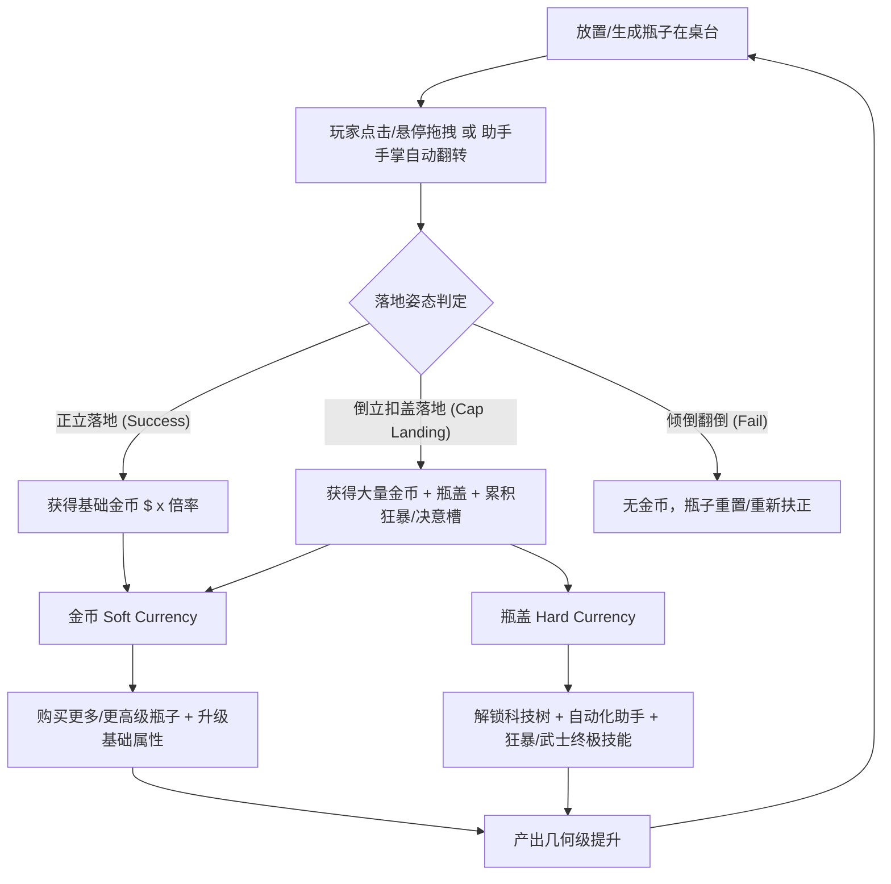
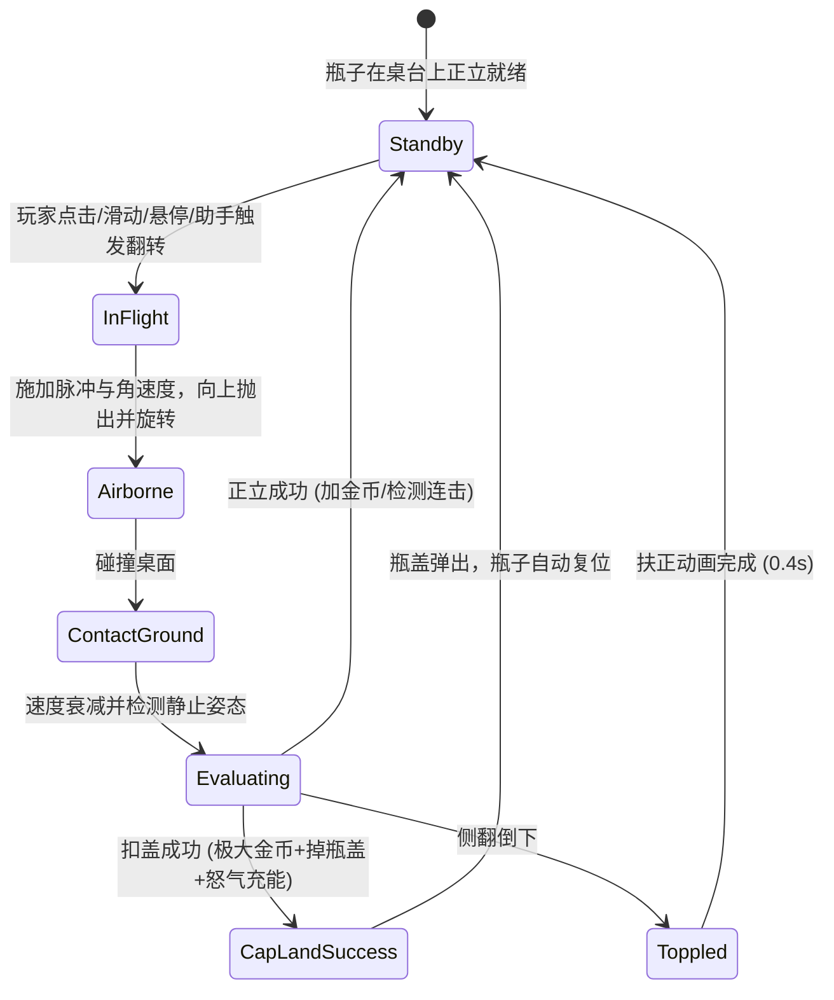

# 《Bottle Flip Inc.》（瓶子翻转公司）100% 竖屏复刻策划方案 (GDD)
> **版本号**：v1.1.0  
> **文档性质**：工业级独立策划与技术落地规范（单一真理源，持续迭代）  
> **目标引擎**：Cocos Creator 3.8.8 (TypeScript)  
> **适配方向**：移动端竖屏 (Portrait) 适配（标准设计分辨率 `720 × 1280` / `1080 × 1920`）  
> **原版工程来源**：Unity 2022.3+ IL2CPP 独立包体反编译与资源提取解析  

---

## 目录
1. [原版工程逆向框架分析 (Reverse Engineering & Architecture)](#1-原版工程逆向框架分析)
2. [竖屏复刻整体定位与适配规范 (Portrait Adaptation & Specifications)](#2-竖屏复刻整体定位与适配规范)
3. [核心玩法与物理判定机制 (Core Mechanics & Physics)](#3-核心玩法与物理判定机制)
4. [游戏经济与七阶瓶子体系 (Economy & 7 Bottle Tiers)](#4-游戏经济与七阶瓶子体系)
5. [四大技能树与三大终极机制 (Skill Trees & Special Mechanics)](#5-四大技能树与三大终极机制)
6. [助手系统与自动化挂机 (Helper Hands & Automation)](#6-助手系统与自动化挂机)
7. [里程碑成长系统 (Milestones 24 阶段真实阈值)](#7-里程碑成长系统-milestones-24-阶段真实阈值)
8. [竖屏 UI 架构与线框布局 (Portrait UI Layout & Wireframes)](#8-竖屏-ui-架构与线框布局)
9. [视听资产与 Cocos 3.8.8 资源映射 (Asset Mapping)](#9-视听资产与-cocos-388-资源映射)
10. [Cocos Creator 3.8.8 技术架构与脚本落地指南 (Technical Architecture)](#10-cocos-creator-388-技术架构与脚本落地指南)
11. [边缘异常与容灾机制 (Edge Cases & Exception Handling)](#11-边缘异常与容灾机制)
12. [版本迭代与里程碑规划 (Roadmap & Milestones)](#12-版本迭代与里程碑规划)

---

## 1. 原版工程逆向框架分析

通过对原工程 `Bottle Flip Inc Demo` 的资产包（`sharedassets1.assets`、`resources.assets`、`StreamingAssets/aa` Addressables 本地化包）以及 IL2CPP 元数据（`global-metadata.dat`）的底层解析，提炼出原游戏的完整模块与架构体系：

### 1.1 核心脚本模块划分（原 `06_Scripts` 逆向清单）
原工程采用模块化解耦设计，核心脚本分为 6 大领域：
- **数据层 (Data & SO)**：
  - `GameData`, `Data`, `GlobalVariable`：全局运行时与持久化根数据。
  - `BottleData`, `BottleRuntimeData`, `BottleStatData`, `BottleSaveData`：瓶子静态规格、运行时属性与存档。
  - `PlayerData`, `PlayerRuntimeData`, `PlayerSaveData`：玩家光标范围、挂机收益、传送带等级。
  - `HelperData`, `HelperRuntimeData`, `HelperHandData`：助手手掌数量、移动速度、抓取冷却。
  - `AbilityData`, `AbilitySaveData`：技能状态（飞天可乐、狂暴、武士处决）。
  - `UpgradeStatData`, `MachineSpeedData`, `AreaSizeBuyableLimitData`：数值公式与购买上限限制。
  - `AchievementData`, `AchievementSO`：成就配置与完成条件。
- **游戏逻辑层 (Gameplay)**：
  - `BottleFlip.cs`, `BottleFlipCollider.cs`, `MatchCircleCollider.cs`：瓶子旋转物理、底部吸附、着陆角度判定（正立/倒立扣盖/倒地倾覆）。
  - `BottleCap.cs`, `ICapGate.cs`, `MachineGate.cs`：瓶盖弹射、收集、传送带闸门翻倍过滤。
  - `MachineController.cs`, `CapMachineUnlockController.cs`：瓶盖机传送带控制器。
  - `BottleAreaFlipper.cs`, `AreaProjectile.cs`：光标范围悬停翻转判定。
  - `HelperMovement.cs`, `HelperHandSpawner.cs`：自动化助手手掌寻路、伸缩、点击翻转。
  - `FlyingCoke.cs`, `FlyingCokeSpawner.cs`：随机横穿屏幕的飞天可乐及其被击中时触发的冲击波（Shockwave）。
- **核心管理器 (Managers)**：
  - `GameManager.cs`：全局主循环与状态机。
  - `BottleFlipManager.cs`：同屏瓶子生成、回收、池化管理。
  - `UpgradeManager.cs`：金币/瓶盖消耗、升级派发、属性脏标记刷新。
  - `BerserkController.cs`：狂暴连续扣盖计数器与限时翻倍状态机。
  - `SamuraiExecutionController.cs`：决意值（Resolve）累积、空中定格、拔刀居合斩连击扣盖。
  - `EconomyStatsTracker.cs`：总收益、总翻转数、总瓶盖数追踪。
  - `AudioManager.cs`：音效与环境音循环控制。
  - `SaveManager.cs`：本地存档（JSON / 本地序列化）。
- **完成度检查器 (Completion Checkers)**：
  - `ShopCompletionChecker`, `UpgradeCompletionChecker`, `SkillTreeCompletionChecker`, `GameCompletionChecker` 等。
- **UI 与交互表现 (UI & Visuals)**：
  - `MainHUD`, `FrontPageUI`, `FrontCurrencyHUD`, `BottleCapUI`, `BottleStatUI`。
  - 升级面板：`BottleUpgradeMenuUI`, `PlayerUpgradeMenuUI`, `HelperUpgradeMenuUI`。
  - 技能树与提示：`AbilitySkillTreeUpgradeUI`, `SkillTreeHUD`, `SkillTooltipUI`。
  - 特殊状态 HUD：`BerserkHUD`, `SamuraiExecutionHUD`, `FlyingCokeHUD`。
  - 辅助效果：`FloatingTextManager`（飘字系统）、`CameraShakeController`（震屏反馈）、`ButtonHoverEffect`、`ButtonPressEffectUI`。

### 1.2 原版核心游戏循环 (Core Game Loop)



---

## 2. 竖屏复刻整体定位与适配规范

原版为 PC 横屏/窗口化演示版，本次复刻目标为 **移动端/H5 竖屏游戏**（支持微信小游戏、抖音小游戏、Web 移动端、Android/iOS 原生打包）。

### 2.1 屏幕与视口设计标准
- **基准分辨率**：`720 × 1280`（设计分辨率），Cocos 适配策略：`Fit Width`（宽适配，保证操作台与操作区域不被裁切）。
- **安全区规范**：
  - 顶部预留 `88px`（刘海屏/状态栏/胶囊按钮区）。
  - 底部预留 `64px`（虚拟 Home 条 / 全面屏手势区）。
- **帧率基线**：目标稳定 60 FPS（低端机型 30 FPS 保底）。

### 2.2 竖屏三段式视口布局 (Three-Tier Vertical Layout)

```
+---------------------------------------------------+ [顶部安全区 88px]
|  [设置/声音]   [$ 金币计数]   [瓶盖计数]   [成就]   | Top HUD: 资源状态栏 (高 120px)
+---------------------------------------------------+
|  [狂暴槽 / 决意槽 HUD]                             |
|                                                   |
|             (飞天可乐穿越空域)                     |
|                                                   |
|      [助手手掌 1]           [助手手掌 2]           | Middle Stage: 主操作舞台 (高 680px)
|          |                      |                 | - 传送带/实验操作台 (Conveyor / Desk)
|          V                      V                 | - 同屏可放置 1~8 个瓶子
|      +--------+             +--------+            | - 物理翻转、特效粒子、跳字区域
|      | 瓶子 A |             | 瓶子 B |            |
|      +--------+             +--------+            |
|     ========================================      |
|               [ 底部传送带 / 闸门 ]                |
+---------------------------------------------------+
| [瓶子升级]  |  [玩家/光标]  |  [助手升级]  | [技能树] | Tab Navigation: 底部系统标签页 (高 100px)
+---------------------------------------------------+
|  可向上滑动展开的抽屉式升级列表 / 科技树全屏抽屉面板  | Bottom Drawer: 抽屉式面板 (默认收起，高 380px)
+---------------------------------------------------+ [底部安全区 64px]
```

---

## 3. 核心玩法与物理判定机制

### 3.1 瓶子翻转物理力学模型 (Bottle Flipping Mechanics)
在 Cocos Creator 3.8.8 中，采用 **2D 刚体物理 (`RigidBody2D` + `BoxCollider2D` / 自定义复合碰撞体)** 模拟真实翻水瓶力学：

#### 1. 输入触发方式 (Input Triggers)
- **点击/轻扫 (Tap / Swipe Up)**：
  - 点击瓶身或向上滑动手势：施加向上的线性冲量 $J_y$ 以及旋转角冲量 $\tau$。
  - 线性冲量公式：
    $$J_y = \text{BaseForceY} \times (1 + \text{FlipSpeedMultiplier}) \times \text{ForceFactor}$$
  - 角动量/旋转冲量公式：
    $$\tau = \text{BaseTorque} \times \text{Direction} \times (1 \pm \text{RandomVariance})$$
  - 其中 $\text{BaseForceY} = 8.5\text{ N}\cdot\text{s}$，$\text{BaseTorque} = 14.5\text{ N}\cdot\text{m}\cdot\text{s}$，$\text{Direction} \in \{-1, 1\}$（随机向左或向右旋转），$\text{RandomVariance} \in [0, 0.25]$。
- **光标/手指悬停触发 (Hover Area Mode)**：
  - 当解锁单瓶的 `UpgradeHoverModeCost`（悬停翻转模式）后，玩家按住屏幕在瓶身上方滑过，若光标距离瓶心小于光标半径 $R_{cursor}$（基础 $0.55\text{m} = 55\text{px}$，随科技树升级），即可免点击自动触发腾空。
- **助手机械手自动翻转 (Helper Hand Trigger)**：
  - 自动化机械手移动至瓶子正上方后，执行 $0.12\text{s}$ 下压动作并向瓶子触发一次标准起跳翻转。
- **连锁与连环翻转 (Chained & Random Flips)**：
  - **连环翻转 (`FlipAgainUpgrade`)**：瓶子落地成功后，有 $P_{again} = 2\% \times L$ 几率立即再度腾空翻转。
  - **随机连锁 (`RandomFlipUpgrade`)**：瓶子落地成功后，有 $P_{random} = 2\% \times L$ 几率向场上随机挑选另一个正立静止的瓶子施加翻转冲量。

#### 2. 物理世界环境与刚体参数规范 (2D Physics Parameters)
原版 Unity 物理系统与 Cocos Creator 3.8.8 物理参数一一对应：
- **重力加速度 (Gravity)**：$\vec{g} = (0, -9.81)\text{ m/s}^2$（对应 Cocos `PhysicsSystem2D.instance.gravity`）。
- **刚体类型 (RigidBody Type)**：`RigidBody2D.Type.Dynamic`。
- **质量与密度 (Mass & Density)**：基础密度 $\rho = 1.0$，T1~T7 质量递增（$1.0 \sim 2.5$），使得高阶金属瓶与宝石瓶落地更为沉稳。
- **线性阻尼 (Linear Damping)**：$0.10$（微小空气阻力，保证腾空抛物线自然）。
- **角阻尼 (Angular Damping)**：$0.40$（确保空中翻转自然减速，消除无休止空翻）。
- **弹性恢复系数 (Restitution)**：$0.15$（极低反弹，防止落地剧烈弹跳导致翻倒）。
- **摩擦系数 (Friction)**：$0.60$（保证落地接触时迅速止滑）。
- **连续碰撞检测 (CCD)**：开启 `bullet = true`，杜绝极速下落穿透台面碰撞体。

#### 3. 碰撞体结构与落地三态精确判定 (Collision & Posture Evaluation)
- **复合碰撞体设计**：
  - **主瓶身碰撞体 (`BodyCollider`)**：`BoxCollider2D`，位于瓶身中段，负责与台面发生物理碰撞并提供支撑面。
  - **底部触地探针 (`BottomSensor`)**：位于瓶底平面的触发器，检测法线朝向。
  - **顶部扣盖探针 (`TopSensor`)**：位于瓶盖上表面，检测倒立扣盖。
- **落地三态判断逻辑**：
  当瓶子碰撞台面，且线速度 $v < 0.25\text{ m/s}$、角速度 $|\omega| < 0.6\text{ rad/s}$ 持续时间达到 $\Delta t \ge 0.20\text{s}$ 时，执行姿态角度检测：
  $$\theta_{raw} = (\text{node.angle} \pmod{360} + 360) \pmod{360}$$
  $$\Delta\theta = |\theta_{raw} > 180 ? \theta_{raw} - 360 : \theta_{raw}|$$
  - **容差角公式**：
    $$\theta_{tolerance} = 18.0^\circ \times (1 + 0.10 \times L_{mastery})$$
  - **三态判定规则**：
    1. **正立成功 (Upright Landing)**：若 $\Delta\theta \le \theta_{tolerance}$，判定为标准正立成功。获得 $1.0\times$ 基础金币收益，保持狂暴连击。
    2. **倒立扣盖暴击 (Cap Landing)**：若 $|180^\circ - \Delta\theta| \le \theta_{tolerance}$，判定为倒立扣盖暴击！获得 $5.0\times$（T2 铜瓶为 $6.0\times$）暴击金币，脱落 1 枚实体瓶盖掉入传送带，狂暴连击计数 $+1$，武士决意槽增加 $+15\%$。
    3. **倾覆翻倒失败 (Toppled / Fail)**：若超出上述角度范围，判定为翻倒。无金币收益，狂暴连击计数清零，播放倾倒晃动后于 $0.40\text{s}$ 内自动扶正复位。

> **★ 实现口径修订（第十七轮，用户拍板，覆盖上面的角度容差模型）**
> 落地判定改为**纯概率制**，七阶瓶子共用一套口径，不再用角度容差 / 质量 / 稳定性：
> - **成功树立概率** $P_{stand} = 50\%$，其中 **倒立（扣盖）10%**、**正立 40%**，失败 50%；
> - **成功池内部按 1:4 归一化分配**（倒立 : 正立 $= 0.1 : 0.4$）：两者占比之和恒 $= 1$，
>   且 $P_{crit} + P_{ok} \equiv P_{stand}$；精通只抬高成功率这个池子的水位、**不改池内比例** ——
>   精通 0 级 $= 倒立 10\% + 正立 40\%$，精通满 10 级 $= 倒立 20\% + 正立 80\% = 100\%$（再无失败）；
> - 各阶「翻转精通」(`mastery`) 每级 **+5% 成功率**，满 **10 级 = 100%**（必成立）；
> - 判定与表演解耦：先掷出 `crit / ok / fail`，瓶子再演对应落地姿态（`Bottle.flip(outcome)`）。
>
> 代码：`FLIP.successBase / successStep / critShareOfSuccess`（`GameConfig.ts`）→
> `G.successChance(tier)` / `G.critChance(tier)` / `G.okChance(tier)` / `G.rollOutcome(tier)`（`State.ts`）。
> 下图 §3.1-3 的角度容差公式与 `p_stability` 抗扰度**仅作历史参考**，不再参与判定。

### 3.2 判定状态机图解 (FSM)



---

## 4. 游戏经济与七阶瓶子体系

游戏内包含两套核心货币驱动经济闭环：
1. **金币 (Money / $)**：软货币，由普通翻转、暴击扣盖产出，用于购买同阶新瓶子、提升瓶子等级与基础属性。
2. **瓶盖 (Bottle Caps)**：硬货币/科技点，由扣盖暴击、传送带瓶盖制造机产出，用于科技树（Skill Tree）解锁、自动化助手雇佣与终极技能进阶。

### 4.1 七阶瓶子数值规格总表 (7 Bottle Tiers)
以下数据直接提取自原版二进制核心资产 `GameStatSO_Balanced` (PID: 769)，为 100% 真实原版数据：

| 阶数 (Tier) | 瓶子名称 (Name) | 对应贴图 (Sprite) | 科技树解锁成本 (Caps) | 商店购买初始金币 ($) | 基础收入倍率 (TimesIncome) | 单次基础金币 (BaseIncome) | 同屏默认上限 | 悬停解锁金币 (HoverCost) | 特殊被动属性 |
| :--- | :--- | :--- | :--- | :--- | :--- | :--- | :--- | :--- | :--- |
| **T1** | 普通塑料瓶 (Classic) | `bottle_classic` / `bottle_white` | **初始自带** (0 盖) | **免费自带** (商店第2瓶 $7) | **$\times 1.0$** | **$\$ 1.0$** | 30 个 | **$\$ 100$** | 基础款，质量轻，起步翻转 |
| **T2** | 铜质能量瓶 (Bronze) | `bottle_bronze` | **1,600 瓶盖** | **$\$ 2,000$** | **$\times 2.0$** | **$\$ 5.0$** | 30 个 | **$\$ 6,000$** | 扣盖金币基础倍率提升为 $6.0\times$ |
| **T3** | 白银汽水瓶 (Silver) | `bottle_silver` | **4,800 瓶盖** | **$\$ 3,000$** | **$\times 3.0$** | **$\$ 20.0$** | 30 个 | **$\$ 16,000$** | 基础收益跃升至 $20.0，扣盖产出大增 |
| **T4** | 黄金尊享瓶 (Gold) | `bottle_gold` | **10,000 瓶盖** | **$\$ 50$** (初购) | **$\times 4.0$** | **$\$ 50.0$** | 30 个 | **$\$ 10,000$** | 扣盖时必定额外掉落 1 枚瓶盖 |
| **T5** | 红宝石烈酒瓶 (Ruby) | `bottle_ruby` | **20,000 瓶盖** | **$\$ 150$** (初购) | **$\times 5.0$** | **$\$ 150.0$** | 30 个 | **$\$ 25,000$** | 狂暴期间收益额外 $+50\%$ |
| **T6** | 翡翠神圣瓶 (Emerald) | `bottle_emerald` | **45,000 瓶盖** | **$\$ 500$** (初购) | **$\times 6.0$** | **$\$ 500.0$** | 30 个 | **$\$ 100,000$** | 决意值积攒速度 $+25\%$ |
| **T7** | 钻石天界瓶 (Diamond) | `bottle_diamond` | **90,000 瓶盖** | **$\$ 2,500$** (初购) | **$\times 7.0$** | **$\$ 2,500.0$** | 30 个 | **$\$ 230,000$** | 全场所有瓶子总收益永久翻倍 |

---

### 4.2 单瓶 11 大升级词条与真实消耗公式 (Per-Bottle Upgrades)

原版游戏中，每个瓶子在升级面板中均拥有 **11 项独立升级属性**（来源于底层 `GameStatSO_Balanced.BottleData`），其基础价格、等级上限、递增比率与效果增量已通过反编译与二进制字节流完全提取验证：

#### 1. 升级通用数学模型 (Upgrade Formulas)
- **价格递增公式**：
  $$\text{Cost}(L) = \text{BasePrice} \times (\text{PriceMultiplier})^L$$
- **属性增长公式**：
  - **加算模式 (Additive)**：$\text{Stat}(L) = \text{BaseStat} + L \times \text{AdditiveValue}$
  - **乘算模式 (Multiplicative)**：$\text{Stat}(L) = \text{BaseStat} \times (1 + L \times \text{StatMultiplier})$

#### 2. 七阶瓶子 11 大升级词条真实全量参数总矩阵表

| 词条名称 | 模式 | 效果说明 | T1 普通塑料瓶 | T2 铜质能量瓶 | T3 白银汽水瓶 | T4 黄金尊享瓶 | T5 红宝石烈酒瓶 | T6 翡翠神圣瓶 | T7 钻石天界瓶 |
| :--- | :--- | :--- | :--- | :--- | :--- | :--- | :--- | :--- | :--- |
| **瓶身购买成本**<br>`PurchasePriceUpgrade` | 价格递增 | 商店购买第 $N$ 个瓶子单价 | Base: $7<br>Max: 30, R: 1.26 | Base: $2,000<br>Max: 10, R: 1.20 | Base: $3,000<br>Max: 10, R: 1.20 | Base: $50<br>Max: 10, R: 1.10 | Base: $150<br>Max: 10, R: 1.10 | Base: $500<br>Max: 10, R: 1.10 | Base: $2,500<br>Max: 10, R: 1.10 |
| **金币基础收益**<br>`IncomeUpgradeMoney` | 加算 | 提升单次成功翻转基础收益 | Base: $40, Max: 20<br>R: 1.60 (+1/级) | Base: $400, Max: 20<br>R: 1.60 (+5/级) | Base: $3,200, Max: 20<br>R: 1.60 (+20/级) | Base: $1,500, Max: 20<br>R: 1.60 (+1/级) | Base: $4,500, Max: 20<br>R: 1.60 (+1/级) | Base: $15,000, Max: 20<br>R: 1.60 (+1/级) | Base: $75,000, Max: 20<br>R: 1.60 (+1/级) |
| **瓶盖加成收益**<br>`IncomeUpgradeCap` | 加算 | 提升每次倒立扣盖产出的瓶盖/收益 | Base: $20, Max: 10<br>R: 1.20 (+1/级) | Base: $160, Max: 10<br>R: 1.20 (+5/级) | Base: $500, Max: 10<br>R: 1.30 (+20/级) | Base: $10, Max: 10<br>R: 1.50 (+1/级) | Base: $10, Max: 10<br>R: 1.50 (+1/级) | Base: $10, Max: 10<br>R: 1.50 (+1/级) | Base: $10, Max: 10<br>R: 1.50 (+1/级) |
| **收益倍率乘数**<br>`IncomeMultiplierUpgrade` | 乘算 | 全局百分比乘数（每级 +10%） | Base: $40, Max: 10<br>R: 1.10 | Base: $420, Max: 10<br>R: 1.20 | Base: $700, Max: 10<br>R: 1.30 | Base: $100, Max: 10<br>R: 1.00 (固定) | Base: $100, Max: 10<br>R: 1.00 (固定) | Base: $100, Max: 10<br>R: 1.00 (固定) | Base: $100, Max: 10<br>R: 1.50 |
| **翻转动作速度**<br>`SpeedUpgrade` | 乘算 | 加快翻转与下落速度（每级 +10%） | Base: $35, Max: 10<br>R: 1.30 | Base: $200, Max: 10<br>R: 1.20 | Base: $600, Max: 10<br>R: 1.30 | Base: $10, Max: 10<br>R: 1.50 | Base: $10, Max: 10<br>R: 1.50 | Base: $10, Max: 10<br>R: 1.50 | Base: $10, Max: 10<br>R: 1.50 |
| **扣盖瓶盖掉落**<br>`CapGainUpgrade` | 加算 | 扣盖时额外掉落瓶盖数量（每级 +1 盖）| Base: $200, Max: 4<br>R: 2.00 | Base: $750, Max: 5<br>R: 2.00 | Base: $2,500, Max: 4<br>R: 2.00 | Base: $10, Max: 4<br>R: 2.00 | Base: $10, Max: 4<br>R: 2.00 | Base: $10, Max: 4<br>R: 2.00 | Base: $10, Max: 4<br>R: 2.00 |
| **同屏数量上限**<br>`BuyableLimitUpgrade` | 加算 | 增加商店可购瓶子数量（每级 +5 个）| Base: $70, Max: 4<br>R: 1.40 | Base: $410, Max: 4<br>R: 1.20 | Base: $1,200, Max: 4<br>R: 1.30 | Base: $10, Max: 4<br>R: 1.50 | Base: $10, Max: 4<br>R: 1.50 | Base: $10, Max: 4<br>R: 1.50 | Base: $10, Max: 4<br>R: 1.50 |
| **落地判定精通**<br>`FlipMasteryUpgrade` | 乘算 | 扩大落地容差角度范围（每级 +10%）| Base: $50, Max: 10<br>R: 1.10 | Base: $900, Max: 10<br>R: 1.20 | Base: $2,200, Max: 10<br>R: 1.30 | Base: $10, Max: 10<br>R: 1.50 | Base: $10, Max: 10<br>R: 1.50 | Base: $10, Max: 10<br>R: 1.50 | Base: $10, Max: 10<br>R: 1.50 |
| **双倍收益几率**<br>`DoubleIncomeChanceUpgrade`| 乘算 | 翻转成功时双倍金币几率（每级 +10%）| Base: $1,200, Max: 3<br>R: 1.26 | Base: $4,200, Max: 3<br>R: 1.26 | Base: $8,400, Max: 3<br>R: 1.26 | Base: $10, Max: 10<br>R: 1.50 | Base: $10, Max: 10<br>R: 1.50 | Base: $10, Max: 10<br>R: 1.50 | Base: $10, Max: 10<br>R: 1.50 |
| **连环二次翻转**<br>`FlipAgainUpgrade` | 加算 | 落地成功时立即再次腾空（每级 +2%）| Base: $700, Max: 5<br>R: 1.40 | Base: $5,000, Max: 5<br>R: 1.20 | Base: $8,300, Max: 5<br>R: 1.25 | Base: $10, Max: 5<br>R: 1.50 | Base: $10, Max: 5<br>R: 1.50 | Base: $10, Max: 5<br>R: 1.50 | Base: $10, Max: 5<br>R: 1.50 |
| **随机连锁翻转**<br>`RandomFlipUpgrade` | 加算 | 触发其他瓶子同步翻转几率（每级 +2%）| Base: $400, Max: 5<br>R: 1.40 | Base: $2,200, Max: 5<br>R: 1.25 | Base: $4,400, Max: 5<br>R: 1.25 | Base: $10, Max: 5<br>R: 1.50 | Base: $10, Max: 5<br>R: 1.50 | Base: $10, Max: 5<br>R: 1.50 | Base: $10, Max: 5<br>R: 1.50 |
| **悬停翻转模式**<br>`UpgradeHoverModeCost` | 一次性 | 解锁手指/光标悬停即翻转 | **$\$ 100$** | **$\$ 6,000$** | **$\$ 16,000$** | **$\$ 10,000$** | **$\$ 25,000$** | **$\$ 100,000$** | **$\$ 230,000$** |

---

### 4.3 全局收益与暴击统一结算公式 (Master Income Equation)

当任意瓶子落地判定为“成功”时，最终单次结算金币 $\text{FinalIncome}$ 按以下完整数学闭环计算：

$$\text{FinalIncome} = \text{BaseIncome} \times (1 + \text{Bonus}\%) \times M_{landing} \times M_{double} \times M_{berserk} \times M_{samurai} \times M_{global}$$

其中各项系数取值如下：
1. **$\text{BaseIncome}$**：当前瓶子基础收益（T1 为 1.0，T2 为 5.0，T3 为 20.0，T4 为 50.0，T5 为 150.0，T6 为 500.0，T7 为 2,500.0）+ `IncomeUpgradeMoney` 增量。
2. **$\text{Bonus}\%$**：单瓶收益倍率（`IncomeMultiplierUpgrade`）加成百分比 + 全局科技加成百分比。
3. **$M_{landing}$（着陆姿态倍率）**：
   - 普通正立：$M_{landing} = 1.0$
   - 倒立扣盖 (Cap Landing)：$M_{landing} = 5.0$（T2 铜瓶为 $6.0$）
4. **$M_{double}$（双倍几率判定）**：
   - 随机判定 $\text{rand}(0, 1) < P_{double}$，若命中则 $M_{double} = 2.0$，否则 $1.0$。
5. **$M_{berserk}$（狂暴加成）**：
   - 处于狂暴状态：$M_{berserk} = 1.0 + 1.5 \times L_{berserk}$（最高达 $5.5\times \sim 10.0\times$），否则 $1.0$。
6. **$M_{samurai}$（武士处决加成）**：
   - 处于武士处决状态：$M_{samurai} = 1.0 + 0.3 \times L_{samurai}$（基础为 $1.0\times$ 附加居合全屏倒立扣盖），否则 $1.0$。
7. **$M_{global}$（全局被动倍率）**：
   - 拥有更高阶瓶子或完成特定里程碑时生效。

---

### 4.4 商店购买系统明细与阶梯定价表 (Shop Purchases & Price Scales)

游戏中的“商店 (Shop)”主要用于**购买实体对象**（新增场上瓶子数量、新增助手机械手数量、购买关键功能设施）。购买货币分为金币与瓶盖：

#### 1. 瓶子同屏实体购买价格表 (Bottle Shop Purchases)
当玩家在科技树解锁某阶瓶子后，可在商店购买更多该阶瓶子实体同屏翻转（数量受 `Buyable Limit` 约束）。  
购买第 $k$ 个瓶子的金币价格严格遵循 `PurchasePriceUpgrade` 真实曲线：
$$\text{BottlePrice}(Tier, k) = \text{BaseCost}(Tier) \times (R_{price})^{k-1}$$

各阶瓶子购买具体金币价格对照表：

| 阶数 (Tier) | 基础价格 $\text{BaseCost}$ | 增长系数 $R_{price}$ | 第 1 个 (初购) | 第 2 个 | 第 3 个 | 第 4 个 | 第 5 个 | 第 6 个 | 满上限 (30个) |
| :--- | :--- | :--- | :--- | :--- | :--- | :--- | :--- | :--- | :--- |
| **T1 普通** | $\$ 7$ | $1.26$ | **免费自带** | $\$ 7$ | $\$ 9$ | $\$ 11$ | $\$ 14$ | $\$ 18$ | $\$ 4,680$ |
| **T2 稀有** | $\$ 2,000$ | $1.20$ | $\$ 2,000$ | $\$ 2,400$ | $\$ 2,880$ | $\$ 3,456$ | $\$ 4,147$ | $\$ 4,976$ | $\$ 10,320$ |
| **T3 史诗** | $\$ 3,000$ | $1.20$ | $\$ 3,000$ | $\$ 3,600$ | $\$ 4,320$ | $\$ 5,184$ | $\$ 6,220$ | $\$ 7,465$ | $\$ 15,480$ |
| **T4 传说** | $\$ 50$ | $1.10$ | $\$ 50$ | $\$ 55$ | $\$ 60$ | $\$ 66$ | $\$ 73$ | $\$ 80$ | $\$ 118$ |
| **T5 神话** | $\$ 150$ | $1.10$ | $\$ 150$ | $\$ 165$ | $\$ 182$ | $\$ 200$ | $\$ 220$ | $\$ 242$ | $\$ 354$ |
| **T6 神圣** | $\$ 500$ | $1.10$ | $\$ 500$ | $\$ 550$ | $\$ 605$ | $\$ 665$ | $\$ 732$ | $\$ 805$ | $\$ 1,179$ |
| **T7 天界** | $\$ 2,500$ | $1.10$ | $\$ 2,500$ | $\$ 2,750$ | $\$ 3,025$ | $\$ 3,327$ | $\$ 3,660$ | $\$ 4,026$ | $\$ 5,897$ |

#### 2. 助手机械手购买阶梯表 (Helper Hand Purchases)
- **初始解锁成本**：**1,200 瓶盖**（`HelperData.UnlockPrice = 1200`）。
- **初始数量上限**：10 只（可通过 `BuyableLimitUpgrade` 提升，最高可达 100 只）。
- **购买单只手金币消耗公式**（来源于 `HelperData.PurchasePriceUpgrade`）：
  $$\text{HandCost}(N) = 4000 \times (1.10)^N$$
- 关键点位购买消耗与累计总金币：
  - 第 1 只：$\$ 4,000$
  - 第 2 只：$\$ 4,400$
  - 第 3 只：$\$ 4,840$
  - 第 5 只：$\$ 5,856$
  - 第 10 只：$\$ 9,431$（初始满手）
  - 第 18 只：$\$ 20,239$（完成初期扩容）

#### 3. 商店特殊设施与功能购买项 (Facility Purchases)
- **解锁瓶盖制造机 (Unlock Cap Machine)**：
  - 真实解锁成本：**1,000 瓶盖**（`GameStatSO.UnlockCapPrice = 1000`）。
  - 功能：在桌台下方激活运行中的实体传送带与收集料斗，自动接住并回收扣盖弹射出的瓶盖。
- **解锁增益闸门 (Unlock The Gate)**：
  - 真实解锁成本：**8,000 瓶盖**（`PlayerData.GateUnlockUpgrade.BasePrice = 8000`）。
  - 功能：在传送带中段树立发光量子门，通过的瓶盖触发克隆判定。
- **增益闸门双倍概率升级 (Gate Chance to Double)**：
  - 真实成本：基础 **8,200 瓶盖**，上限 10 级，递增比 1.10。
  - 真实效果：每级提升 **+10% 双倍概率**（1级 10%，满级 10 级达到 **100% 绝对双倍**！）。
- **悬停翻转解锁 (Hover Flip)**：
  - 见 4.2 节，T1~T7 消耗 $\$ 3,000 \sim \$ 230,000$ 对应金币解锁。

---

### 4.5 升级系统明细与等级消耗阶梯表 (Upgrade Progression & Cost Scales)

“升级面板 (Upgrade Menu)”用于强化单瓶属性及全局数值。不同于商店的“买新物体”，升级是“增强已有属性”。

#### 1. 瓶子各项升级真实等级与消耗示例
所有升级统一遵循 $\text{Cost}(L) = \text{BasePrice} \times (\text{PriceMultiplier})^L$：
- **T1 普通塑料瓶（示例）**：
  - 收益升级 (`IncomeUpgradeMoney`): Base 10, R 1.60 $\to$ 10, 16, 26, 41, 66, 105, 168...
  - 速度升级 (`SpeedUpgrade`): Base 80, R 1.20 $\to$ 80, 96, 115, 138, 166, 199...
  - 落地精通 (`FlipMasteryUpgrade`): Base 300, R 1.20 $\to$ 300, 360, 432, 518, 622, 746...
  - 双倍几率 (`DoubleIncomeChanceUpgrade`): Base 2100, R 1.26 $\to$ 2100, 2646, 3334 (3级满)
  - 连环翻转 (`FlipAgainUpgrade`): Base 2500, R 1.20 $\to$ 2500, 3000, 3600, 4320, 5184 (5级满)
  - 随机翻转 (`RandomFlipUpgrade`): Base 1100, R 1.25 $\to$ 1100, 1375, 1718, 2148, 2685 (5级满)

#### 2. 升级货币归属对照总览 (Currency Classification)
- **纯金币消耗项 ($)**：
  - 商店购买新瓶子实体、购买助手机械手实体。
  - 瓶子基础收益（Income）、倍率乘数（Multiplier）、翻转速度（Speed）、落地精通（Mastery）、双倍几率（Double）、连环翻转（Again）、随机翻转（Random Flip）、悬停翻转（Hover Flip）。
- **纯瓶盖消耗项 (Caps)**：
  - 瓶子瓶盖收益升级（`IncomeUpgradeCap`）、瓶盖掉落量（`CapGainUpgrade`）。
  - 四大分支科技树的所有研发节点（光标吸附范围、挂机模式、传送带制造机速度/产出、闸门解锁与双倍概率、助手寻路/冷却速度、三大终极技能等级）。
  - 商店中解锁瓶盖制造机设施（1,000 瓶盖）、解锁增益闸门设施（8,000 瓶盖）。

---

## 5. 四大技能树与三大终极机制

科技树以 **瓶盖 (Bottle Caps)** 为研发货币，分为四大分支，每个分支包含详细的前置解锁依赖、等级上限与消耗曲线（全部数据来自 `GameStatSO_Balanced`）：

### 5.1 技能树四大分支配置总表 (Skill Tree Specification)

#### 分支 1：瓶子科技树 (Bottle Skill Tree)
| 节点名称 (Node) | 消耗基础 (Caps) | 增长系数 | 最大等级 | 升级效果与数值公式 |
| :--- | :--- | :--- | :--- | :--- |
| **解锁 T2 稀有铜瓶** | 1,600 | 一次性 | 1 级 | 研发解锁商店购买铜瓶资格，收入倍率 $\times 10.0$ |
| **解锁 T3 史诗银瓶** | 4,800 | 一次性 | 1 级 | 研发解锁商店购买银瓶资格，收入倍率 $\times 20.0$ |
| **解锁 T4 传说金瓶** | 10,000 | 一次性 | 1 级 | 研发解锁商店购买金瓶资格，收入倍率 $\times 50.0$ |
| **解锁 T5 神话红宝石瓶** | 20,000 | 一次性 | 1 级 | 研发解锁商店购买红宝石瓶资格，收入倍率 $\times 150.0$ |
| **解锁 T6 神圣翡翠瓶** | 45,000 | 一次性 | 1 级 | 研发解锁商店购买翡翠瓶资格，收入倍率 $\times 500.0$ |
| **解锁 T7 天界钻石瓶** | 90,000 | 一次性 | 1 级 | 研发解锁商店购买钻石瓶资格，收入倍率 $\times 2,500.0$ |

#### 分支 2：玩家科技树 (Player Skill Tree)
| 节点名称 (Node) | 英文字段标识 | 消耗基础 (Caps) | 增长系数 | 最大等级 | 真实效果与数值公式 |
| :--- | :--- | :--- | :--- | :--- | :--- |
| **光标范围解锁** | `CursorAreaUnlockUpgrade` | 500 | 一次性 | 1 级 | 解锁光标接触即翻转范围（基础半径 $0.55\text{m} / 55\text{px}$，移速 $3.0$） |
| **光标范围升级** | `SizeUpgrade` | 3,000 | 1.15 | 10 级 | 光标吸附范围 $R(L) = 0.55 \times (1 + 0.05 \times L)$ |
| **范围购买上限提升**| `SizeBuyableLimitUpgrade` | 2,000 | 1.30 | 6 级 | 每级增加 $+5$ 级购买上限（Demo 上限 6 级，正式版 18 级） |
| **挂机模式解锁** | `IdleModeUnlockUpgrade` | 1,000 | 一次性 | 1 级 | 开启离线与切后台挂机收益系统（基础时长 $5.0\text{s}$，恢复 $5.0\text{s}$） |
| **挂机移动速度** | `IdleMovementSpeedUpgrade` | 1,000 | 1.50 | 15 级 | 挂机时手掌/光标移速 $V(L) = 3.0 \times (1 + 0.05 \times L)$ |
| **挂机时长上限** | `IdleDurationUpgrade` | 800 | 1.50 | 25 级 | 挂机有效时长每级提升 $+10\%$ |
| **挂机恢复时间缩减**| `IdleRecoverDurationUpgrade`| 1,000 | 1.50 | 15 级 | 疲劳恢复时间每级缩减 $-5\%$ |
| **翻转稳定性提升** | `StabilityUpgrade` | 1,000 | 1.40 | 10 级 | 空中翻转抗扰度与稳定性每级 $+5\%$ |
| **瓶盖机产出加成** | `MachineIncomeUpgrade` | 10,000 | 1.46 | 10 级 | 传送带收集瓶盖价值每级 $+10\%$ |
| **瓶盖机运行速度** | `MachineSpeedUpgrade` | 1,000 | 1.10 | 30 级 | 传送带运转线速度每级 $+10\%$ |
| **双倍增益闸门解锁**| `GateUnlockUpgrade` | 8,000 | 一次性 | 1 级 | 在传送带中段树立量子克隆双倍门 |
| **闸门双倍概率升级**| `GateChanceToDoubleUpgrade`| 8,200 | 1.10 | 10 级 | 穿过闸门瓶盖双倍概率 $P(L) = 10\% \times L$（满级 100% 绝对双倍） |

#### 分支 3：助手科技树 (Helper Skill Tree)
| 节点名称 (Node) | 英文字段标识 | 消耗基础 (Caps) | 增长系数 | 最大等级 | 真实效果与数值公式 |
| :--- | :--- | :--- | :--- | :--- | :--- |
| **解锁助手功能** | `HelperData.UnlockPrice` | 1,200 | 一次性 | 1 级 | 解锁第 1 只机械手自动化（初始上限 10 只，移速 $4.0$，重选 $1.5\text{s}$，恢复 $5.0\text{s}$） |
| **助手购买价格升级**| `PurchasePriceUpgrade` | 4,000 | 1.10 | 10 级 | 降低/优化商店购买助手单价 |
| **助手翻转速度** | `SpeedUpgrade` | 800 | 1.15 | 15 级 | 移动寻路速度每级 $+5\%$ |
| **目标重选时间** | `RepickTargetDurationUpgrade`| 10 | 1.10 | 15 级 | 抓取落空或完成后的重选目标耗时每级 $-10\%$ |
| **疲劳恢复时间** | `RecoveryDurationUpgrade` | 800 | 1.15 | 15 级 | 抓取成功后的冷却恢复时间每级 $-5\%$ |
| **助手持有上限扩充**| `BuyableLimitUpgrade` | 1,800 | 1.30 | 18 级 | 每级增加 $+5$ 只助手手掌持有上限（最高可达 100 只） |
| **铜瓶自动化许可** | `BronzeCapabilityUpgrade` | 3,000 | 一次性 | 1 级 | 允许机械手自动抓取并翻转 T2 铜瓶 |
| **银瓶自动化许可** | `SilverCapabilityUpgrade` | 7,000 | 一次性 | 1 级 | 允许机械手自动抓取并翻转 T3 银瓶 |
| **金瓶自动化许可** | `GoldCapabilityUpgrade` | 15,000 | 一次性 | 1 级 | 允许机械手自动抓取并翻转 T4 金瓶 |
| **翡翠瓶自动化许可**| `EmeraldCapabilityUpgrade`| 32,000 | 一次性 | 1 级 | 允许机械手自动抓取并翻转 T5 翡翠瓶 |
| **红宝石瓶自动化许可**| `RubyCapabilityUpgrade` | 68,000 | 一次性 | 1 级 | 允许机械手自动抓取并翻转 T6 红宝石瓶 |
| **钻石瓶自动化许可**| `DiamondCapabilityUpgrade`| 145,000 | 一次性 | 1 级 | 允许机械手自动抓取并翻转 T7 钻石瓶 |

#### 分支 4：特殊技能科技树 (Ability Skill Tree)
| 技能模块 | 英文字段标识 | 消耗基础 (Caps) | 增长系数 | 最大等级 | 真实数值与升级效果 |
| :--- | :--- | :--- | :--- | :--- | :--- |
| **解锁飞天可乐** | `FlyingCokeUnlockUpgrade` | 4,000 | 一次性 | 1 级 | 开启飞天可乐穿越机制（基础冷却 $75.0\text{s}$，数量 1 瓶） |
| **可乐冷却缩减** | `FlyingCokeCooldownUpgrade` | 4,000 | 1.00 (固定) | 3 级 | 每级减少 **$-20.0\text{s}$** 冷却（$75\text{s} \to 55\text{s} \to 35\text{s} \to 15\text{s}$） |
| **可乐生成数量** | `FlyingCokeCountUpgrade` | 3,000 | 1.00 (固定) | 9 级 | 每级增加 **$+1$ 瓶** 可乐同屏穿越（最多 10 瓶并发） |
| **解锁狂暴模式** | `BerserkUnlockUpgrade` | 12,000 | 一次性 | 1 级 | 开启连续扣盖 3 次激活狂暴机制（基础倍率 $1.0\times$，有效翻转 2 次） |
| **狂暴翻转次数** | `BerserkFrenzyFlipCountUpgrade` | 12,200 | 1.15 | 3 级 | 每级增加 **$+1$ 次** 狂暴翻转有效次数（最高 5 次） |
| **狂暴收益倍率** | `BerserkFrenzyIncomeMultiplierUpgrade` | 12,200 | 1.15 | 3 级 | 每级增加 **$+1.5\times$** 收益倍率（$1.0\times \to 2.5\times \to 4.0\times \to 5.5\times$） |
| **解锁武士处决** | `SamuraiExecutionUnlockUpgrade` | 18,000 | 一次性 | 1 级 | 开启决意槽与武士居合斩终极全屏扣盖（基础定格 $0.8\text{s}$，处决点数上限 3 点） |
| **处决定格时间** | `SamuraiExecutionDurationUpgrade` | 19,000 | 1.15 | 3 级 | 每级延长 **$+0.3\text{s}$** 定格空中拔刀斩时间（最高 $1.7\text{s}$） |
| **处决收益倍率** | `SamuraiExecutionGainUpgrade` | 19,000 | 1.15 | 3 级 | 每级增加 **$+0.3\times$** 处决暴击加成倍率 |

---

### 5.2 三大终极技能工作流与参数规格

```mermaid
graph TD
    subgraph 飞天可乐 Shockwave
        C1[定时触发 75s~15s] --> C2[发光可乐 1~10 瓶斜向高速穿屏]
        C2 --> C3[玩家点击/划过击中]
        C3 --> C4[释放全屏冲击波 Shockwave]
        C4 --> C5[全场瓶子 100% 成功起飞并翻转]
    end
    
    subgraph 狂暴模式 Berserk Frenzy
        B1[玩家操作达成连续 3 次扣盖] --> B2[全屏边缘烈火灼烧特效激活]
        B2 --> B3[进入 2~5 次翻转狂暴状态]
        B3 --> B4[期间金币增加 1.0x~5.5x 且下落加速]
        B4 --> B5[次数耗尽平滑恢复常态]
    end
    
    subgraph 武士处决 Samurai Execution
        S1[翻转累积决意点数，上限 3 点] --> S2[决意值蓄满]
        S2 --> S3[玩家点击发动处决技能]
        S3 --> S4[全屏时空定格 0.8s~1.7s + 水墨暗角 + 万瓶凌空]
        S4 --> S5[居合斩光痕划过 + 强震屏 0.3s]
        S5 --> S6[所有瓶子 100% 强制倒立扣盖 +暴击收益]
    end
```



---

## 6. 助手系统、传送带与自动化闭环

### 6.1 助手机械手购买消耗曲线 (Helper Hand Purchasing)
- **解锁资格**：消耗 **1,200 瓶盖** 在科技树解锁。
- **初始上限**：10 只手，可通过科技树 `BuyableLimitUpgrade` 提升至 100 只。
- **购买金币消耗公式**（来源于 `HelperData.PurchasePriceUpgrade`）：
  $$\text{HandCost}(N) = 4000 \times (1.10)^N$$
- $N$ 为当前已拥有的机械手数。达到 30 只、60 只、100 只时，分别解锁对应的阶段性成就。

### 6.2 离线挂机收益算法 (Offline AFK Equation)
玩家离开游戏（切后台或离线关闭）时间为 $\Delta t$ 秒：
1. **有效时长截断**：
   $$\Delta t_{valid} = \min(\Delta t, T_{idle})$$
   其中 $T_{idle}$ 取决于玩家科技树中的挂机时长上限（基础 $5.0\text{s}$，通过升级可达数小时）。
2. **场上每只手单位时间收益期望**：
   $$E_{hand} = \frac{1}{T_{move} + T_{action} + T_{rec}} \times \overline{P}_{bottle} \times \overline{\text{Rate}}_{success}$$
   - $T_{move} = 4.0 / \text{SpeedUpgrade}$（平均寻路移动时间）
   - $T_{action} = 1.0\text{s}$（翻转动作时间）
   - $T_{rec}$ 为当前恢复冷却时间（基础 $5.0\text{s}$，每级缩减 $-5\%$）
   - $\overline{P}_{bottle}$ 为场上所有已激活瓶子的平均基础单次收益
   - $\overline{\text{Rate}}_{success}$ 为平均落地成功率
3. **最终离线产出**：
   $$\text{Offline Income} = N_{hands} \times E_{hand} \times \Delta t_{valid}$$
   - 重新登录时，弹出结算界面展示挂机总金币与总翻转数，并提供“双倍领取”激励广告按钮。

### 6.3 瓶盖传送带与双倍闸门系统 (Cap Machine & Gate System)
原版特色之一是位于桌台下方的传送带装置（`MachineController`, `MachineGate`）：
1. **物理掉落**：场上瓶子只要触发“倒立扣盖 (Cap Landing)”，实体瓶盖（`BottleCap.ts`）脱离瓶身，受重力影响弹跳掉落至下方的传送带上。
2. **传送带传送**：
   - 解锁成本：**1,000 瓶盖**（`GameStatSO.UnlockCapPrice = 1000`）。
   - 传送带以线速度 $V_{conveyor}$（基础速度，每级升级 $+10\%$）从左向右运送瓶盖。
3. **闸门过滤 (The Gate)**：
   - 解锁成本：**8,000 瓶盖**（`PlayerData.GateUnlockUpgrade.BasePrice = 8000`）。
   - 传送带中段设有发光的量子闸门（Gate）。
   - 当瓶盖穿过闸门刚体触发器时，执行双倍克隆概率判定：
     $$P_{gate\_double} = 10\% \times L_{gate} \quad (L_{gate} \in [1, 10])$$
   - 若判定成功：闸门爆发出闪电光效，立即**额外克隆生成 1 枚相同的瓶盖**并排前行！满级 10 级时达到 **100% 绝对双倍**。
4. **终点收集箱 (Cap Vault / Recycle)**：
   - 传送带最右侧为收集料斗。瓶盖进入料斗时播放“叮当”清脆收钱音效，正式计入玩家顶部的“瓶盖存款”中。

---

### 6.4 全 24 项成就配置与解锁条件总表 (24 Achievements Table)

| 编号 | 成就标识 (ID) | 中文标题 | 英文标题 | 触发条件 | 数值阈值 | 解锁奖励 |
| :--- | :--- | :--- | :--- | :--- | :--- | :--- |
| 1 | `ACH_COMMON_BOTTLE` | 普通瓶子 | Common Bottle | 首次翻转普通瓶子 | 1 次 | 100 金币 |
| 2 | `ACH_BOTTLE_CAP` | 瓶盖初见 | Bottle Cap | 首次解锁瓶盖功能 | 1 次 | 20 瓶盖 |
| 3 | `ACH_100K_MONEY` | 财富起步 | 100K Money | 累计获得金币 | $\$ 100,000$ | 50 瓶盖 |
| 4 | `ACH_RARE_BOTTLE` | 稀有瓶子 | Rare Bottle | 购买首个稀有铜瓶 | 1 个 | 500 金币 |
| 5 | `ACH_HELPER_HAND` | 第一只助手 | Helper Hand | 购买首只机械手 | 1 只 | 30 瓶盖 |
| 6 | `ACH_1M_MONEY` | 百万富翁 | 1M Money | 累计获得金币 | $\$ 1,000,000$ | 150 瓶盖 |
| 7 | `ACH_EPIC_BOTTLE` | 史诗瓶子 | Epic Bottle | 购买首个史诗银瓶 | 1 个 | 2,000 金币 |
| 8 | `ACH_100K_CAPS` | 瓶盖储藏家 | 100K Bottle Caps | 累计获得瓶盖 | 100,000 枚 | 全场收益 $+10\%$ |
| 9 | `ACH_AUTOMATION` | 自动化初期 | Automation | 拥有机械手数达到 | 30 只 | 300 瓶盖 |
| 10 | `ACH_100K_FLIPS` | 翻转大师 | 100K Flips | 累计翻转次数达到 | 100,000 次 | 翻转速度 $+5\%$ |
| 11 | `ACH_10M_MONEY` | 千万富豪 | 10M Money | 累计获得金币 | $\$ 10,000,000$ | 500 瓶盖 |
| 12 | `ACH_LEGENDARY_BOTTLE` | 传说瓶子 | Legendary Bottle | 购买首个黄金传说瓶 | 1 个 | 10,000 金币 |
| 13 | `ACH_1M_CAPS` | 瓶盖大亨 | 1M Bottle Caps | 累计获得瓶盖 | 1,000,000 枚 | 全场收益 $+25\%$ |
| 14 | `ACH_MYTHIC_BOTTLE` | 神话瓶子 | Mythic Bottle | 购买首个红宝石神话瓶 | 1 个 | 50,000 金币 |
| 15 | `ACH_MORE_HANDS` | 助手军团 | More Hands | 拥有机械手数达到 | 60 只 | 1,000 瓶盖 |
| 16 | `ACH_100M_MONEY` | 亿万富豪 | 100M Money | 累计获得金币 | $\$ 100,000,000$ | 2,000 瓶盖 |
| 17 | `ACH_DIVINE_BOTTLE` | 神圣瓶子 | Divine Bottle | 购买首个翡翠神圣瓶 | 1 个 | 200,000 金币 |
| 18 | `ACH_CELESTIAL_BOTTLE` | 天界瓶子 | Celestial Bottle | 购买首个钻石天界瓶 | 1 个 | 1,000,000 金币 |
| 19 | `ACH_1B_MONEY` | 十亿巨擘 | 1B Money | 累计获得金币 | $\$ 1,000,000,000$ | 10,000 瓶盖 |
| 20 | `ACH_1M_FLIPS` | 翻转传说 | 1M Flips | 累计翻转次数达到 | 1,000,000 次 | 落地率 $+5\%$ |
| 21 | `ACH_IDLE_KING` | 挂机之王 | Idle King | 拥有机械手数达到 | 100 只 | 挂机效率 $+20\%$ |
| 22 | `ACH_ABILITY_MASTER` | 技能大师 | Ability Master | 解锁并学满所有特殊技能 | 全满 | 50,000 瓶盖 |
| 23 | `ACH_SKILL_TREE` | 科技通晓 | Skill Tree | 研发完科技树所有节点 | 全满 | 100,000 瓶盖 |
| 24 | `ACH_100_PERCENT` | 究极通关 | 100% | 完成游戏所有系统与收集 | 100% | 获得通关纪念金杯 |

---

## 7. 里程碑成长系统 (Milestones 24 阶段真实阈值)

原版游戏中，游戏进度由 `MilestoneSO`（PID: 771）精确控制，其成长模型与 24 个目标阈值直接从包体中提取：

### 7.1 里程碑数学成长模型
- **起始目标值**：$\text{StartValue} = 10$
- **基础成长倍率**：$\text{Multiplier} = 1.50$
- **加算常数**：$\text{Additive} = 5$
- **递增增量系数**：$\text{IncrementalMultiplier} = 0.01$
- 阶段递推公式：
  $$M_0 = \text{StartValue} = 10$$
  $$M_n = \text{Round}\Big(M_{n-1} \times (\text{Multiplier} + n \times \text{IncrementalMultiplier}) + \text{Additive}\Big)$$

### 7.2 原版 24 阶段里程碑目标值全量对照表

| 阶段 | 目标值 (Threshold) | 典型达成行为 / 对应游戏进度 | 阶段奖励 |
| :--- | :--- | :--- | :--- |
| **M1** | **10** | 翻转普通瓶子达到 10 次 | 开启基础收益统计 |
| **M2** | **20** | 翻转达到 20 次 | 掉落初见瓶盖 |
| **M3** | **35** | 累计金币达到 35 | 解锁商店初级升级 |
| **M4** | **59** | 累计金币达到 59 | 开启单瓶属性强化 |
| **M5** | **95** | 累计翻转 95 次 | 解锁光标范围研发 |
| **M6** | **151** | 累计获得金币 151 | 积累解锁首只助手资本 |
| **M7** | **238** | 累计获得瓶盖 238 | 推进科技树研发 |
| **M8** | **377** | 累计获得金币 377 | 购买首只助手机械手 |
| **M9** | **597** | 拥有机械手并翻转 | 开启自动化挂机体验 |
| **M10** | **948** | 累计瓶盖接近千枚 | 研发解锁 T2 铜瓶 (1,600 瓶盖) |
| **M11** | **1,512** | 突破千级金币大关 | 瓶盖制造机激活 (1,000 瓶盖) |
| **M12** | **2,424** | 传送带持续回收入库 | 解锁飞天可乐技能 (4,000 瓶盖) |
| **M13** | **3,907** | 自动化手掌达到 5 只 | 研发解锁 T3 史诗银瓶 (4,800 瓶盖) |
| **M14** | **6,335** | 多瓶同屏协同翻转 | 双倍增益闸门激活 (8,000 瓶盖) |
| **M15** | **10,331** | 研发解锁 T4 黄金传说瓶 | 触发狂暴连击机制 (12,000 瓶盖) |
| **M16** | **16,948** | 助手机械手达到 20 只 | 解锁武士处决技能 (18,000 瓶盖) |
| **M17** | **27,969** | 研发解锁 T5 红宝石神话瓶 | 全自动全屏流光溢彩 |
| **M18** | **46,433** | 研发解锁 T6 翡翠神圣瓶 | 助手机械手突破 40 只 |
| **M19** | **77,548** | 狂暴与居合斩高频触发 | 冲刺终极天界科技 |
| **M20** | **130,285** | 研发解锁 T7 钻石天界瓶 (90K 盖) | 达成天界收益翻倍 |
| **M21** | **220,187** | 助手机械手达到 60 只 | 挂机离线收益爆发 |
| **M22** | **374,324** | 科技树核心节点全部点满 | 达成自动化军团成就 |
| **M23** | **640,098** | 全屏百手狂舞极速翻转 | 达成千万级财富闭环 |
| **M24** | **1,100,974** | **终极里程碑** | **达成 100% 究极通关，获纪念金杯** |

---

## 8. 竖屏 UI 架构与线框布局 (Portrait UI Layout & Wireframes)

针对移动端竖屏（`9:16` ~ `9:20`，设计分辨率 `1080 × 1920`）适配，将操作与交互空间进行严格层级隔离，杜绝底部面板与弹窗遮挡中间主视区的物理翻转操作：

### 8.1 主界面 ASCII 线框原型 (Portrait Main Wireframe)

```
+-------------------------------------------------------------+
| [设置] [语言]   $ 1.25M (金币)    [O] 450 (瓶盖)    [成就] | <- Top HUD (y: 1800~1920)
+-------------------------------------------------------------+
| [=== 狂暴连击: 2/3 ===]       [=== 决意槽: [||||||    ] 60% ===] | <- 状态蓄力条 (y: 1720~1800)
|                                                             |
|                          \ 飞天可乐 /                        | <- 穿屏事件层 (斜向滑翔)
|                                                             |
|       [机械手1]             [机械手2]             [机械手3]    | <- 助手巡航层 (y: 1100~1500)
|           |                     |                     |     |
|           V                     V                     V     |
|      +---------+           +---------+           +---------+|
|      | T1 普通 |           | T3 白银 |           | T4 黄金 || <- 中部翻转台面主视区
|      +---------+           +---------+           +---------+|    (y: 650~1350)
|    =======================================================  | <- 物理台面 (Table Top)
|     [===== 瓶盖传送带 Belt =====]  [ [门] 双倍闸门 ] -> [料斗] | <- 底部机械传送带 (y: 450~650)
|                                                             |
+=============================================================+
|  [ 瓶子升级 ]  |  [ 商店购买 ]  |  [ 助手强化 ]  |  [ 技能树 ]  | <- 主导航 Tab 栏 (y: 350~450)
+-------------------------------------------------------------+
| [^ 向上滑动展开升级抽屉 (Drawer Panel)                     ] | <- 底部抽屉折叠状态
| [T1 普通塑料瓶]  Lv.12  收益: $120/次   [ 升级 $ 2,400 ]     |    (可展开至 y: 1200)
| [T2 铜质能量瓶]  Lv.5   收益: $450/次   [ 升级 $ 8,600 ]     |
| [T3 白银汽水瓶]  Lv.1   收益: $1.2K/次  [ 升级 $ 35.0K ]     |
+-------------------------------------------------------------+
```

### 8.2 底部抽屉升级面板展开原型 (Drawer Upgrade Panel)

```
+-------------------------------------------------------------+
| [v 向下滑动收起抽屉]           [瓶子升级面板]           [X 关闭] |
+-------------------------------------------------------------+
| [当前选中]: T3 白银汽水瓶 (Silver Soda)  当前收益乘数: x20.0  |
| ----------------------------------------------------------- |
| 1. 基础金币 (Income)        Lv.12/20    +$20/级    [ $ 3.2K ]|
| 2. 收益倍率 (Multiplier)    Lv.3/10     +10%/级    [ $ 1.2K ]|
| 3. 翻转速度 (Speed)         Lv.5/10     +10%/级    [ $ 1.5K ]|
| 4. 扣盖掉落 (Cap Gain)      Lv.2/4      +1盖/级    [ (O) 2.5K]|
| 5. 同屏上限 (Buyable Limit) Lv.1/4      +5瓶/级    [ $ 1.5K ]|
| 6. 落地精通 (Mastery)       Lv.4/10     +10%/级    [ $ 3.7K ]|
| 7. 双倍几率 (Double Income) Lv.1/3      +10%/级    [ $ 10.6K]|
| 8. 连环翻转 (Flip Again)    Lv.2/5      +2%/级     [ $ 12.0K]|
| 9. 随机翻转 (Random Flip)   Lv.1/5      +2%/级     [ $ 5.5K ]|
| 10. 悬停翻转 (Hover Mode)   已解锁      光标划过即翻转 [ MAX ]|
+-------------------------------------------------------------+
| [快捷购买同屏新瓶]: [ 购买第 4 只 $ 5,184 ] (同屏上限: 35 只) |
+-------------------------------------------------------------+
```

### 8.3 全屏科技树模态窗原型 (Skill Tree Modal with Zoom & Pan)

```
+-------------------------------------------------------------+
| [< 返回台面]          科技研发中心 (Skill Tree)      [瓶盖: 4,800] |
+-------------------------------------------------------------+
| [ 标签: 瓶子科技 ] [ 标签: 玩家科技 ] [ 标签: 助手自动化 ] [ 标签: 终极技能 ] |
+-------------------------------------------------------------+
|                                                             |
|         (O) 初始普通瓶                                       |
|               |                                             |
|        [线: 已激活]                                         |
|               V                                             |
|         (O) 解锁铜质能量瓶 (成本: 1,600 瓶盖) [已研发]       |
|               |                                             |
|        [线: 已激活]                                         |
|               V                                             |
|    +--> (O) 解锁白银汽水瓶 (成本: 4,800 瓶盖) [可研发]       |
|    |          |                                             |
|    |   [线: 灰色未解锁]                                      |
|    |          V                                             |
|    |    (X) 解锁黄金尊享瓶 (成本: 10,000 瓶盖) [前置未达成]  |
|    |                                                        |
|  [缩放手势: 双指捏合 0.5x ~ 2.0x / 单指拖拽平移画布]         |
+-------------------------------------------------------------+
| 选中节点: [解锁白银汽水瓶]  消耗: 4,800 瓶盖   [ 点击立即研发 ]|
| 效果: 开放商店购买资格，单次基础金币提升至 $20.0，收入乘数 x20 |
+-------------------------------------------------------------+
```

### 8.4 商店购买弹窗原型 (Shop Modal Wireframe)

```
+-------------------------------------------------------------+
| [X 关闭]                   道具与设施商店                    |
+-------------------------------------------------------------+
| [ 标签: 瓶子采购 ]    [ 标签: 助手机械手 ]    [ 标签: 核心设施 ]|
+-------------------------------------------------------------+
| [T1 普通塑料瓶]  已拥有: 5/30 只      [ 购买第 6 只: $ 18 ]  |
| [T2 铜质能量瓶]  已拥有: 2/10 只      [ 购买第 3 只: $ 2,880]|
| [T3 白银汽水瓶]  已拥有: 1/10 只      [ 购买第 2 只: $ 3,600]|
| [T4 黄金尊享瓶]  (需在科技树解锁)     [ 前往科技树研发 ]     |
| ----------------------------------------------------------- |
| [助手机械手]     已拥有: 3/10 只      [ 购买第 4 只: $ 5,324]|
| ----------------------------------------------------------- |
| [瓶盖制造机]     已安装 (传送带运转中) [ 速度 Lv.5 / 产出 Lv.2]|
| [双倍增益闸门]   已安装 (当前双倍率: 30%) [ 升级概率 (O) 9.9K ] |
+-------------------------------------------------------------+
```

### 8.5 离线挂机结算弹窗原型 (Offline AFK Result Modal)

```
+-------------------------------------------------------------+
|                     欢迎回来，老板！                        |
+-------------------------------------------------------------+
|  您已离开工作台: 02 小时 45 分钟                             |
|  助手机械手在您离开期间持续辛勤翻转...                       |
|                                                             |
|           累计完成翻转: 3,420 次                            |
|           达成扣盖暴击: 412 次                              |
|                                                             |
|           获得离线金币: $ 185,400                           |
|           回收传送带瓶盖: 412 枚                            |
|                                                             |
|     +-------------------------------------------------+     |
|     |     [ 看广告领取 2 倍收益: $ 370,800 + 824 盖 ]  |     |
|     +-------------------------------------------------+     |
|     |                [ 普通直接领取 ]                 |     |
|     +-------------------------------------------------+     |
+-------------------------------------------------------------+
```

### 8.6 UI 层级管理规范 (Canvas Z-Order)
- **Layer 0: Background Layer (Z: 0~10)**：滚动背景、环境光影、实验台暗调渐变。
- **Layer 1: Game World Layer (Z: 10~50)**：物理桌台、传送带刚体、瓶子刚体、助手手掌节点。
- **Layer 2: World FX Layer (Z: 50~100)**：拔刀刀光特效、冲击波环形光效、暴击金币爆炸粒子、飘字（`FloatingText`）。
- **Layer 3: Main HUD Layer (Z: 100~200)**：顶部资源条（金币/瓶盖）、状态蓄力条（连击/决意）、底部导航 Tab 栏。
- **Layer 4: Drawer / Sub-panel Layer (Z: 200~300)**：底部升级抽屉（Tween 升降）、单瓶属性强化列表。
- **Layer 5: Modal & Dialog Layer (Z: 300~500)**：全屏科技树模态窗（`SkillTreeModal`）、成就弹窗（`AchievementPopUpUI`）、离线收益结算弹窗（`ResultUI`）、商店弹窗（`ShopModal`）。
- **Layer 6: Guide & Topmost Layer (Z: 500~1000)**：新手引导手势指引、全屏转场遮罩暗幕、网络/异常浮层。

---

## 9. 视听资产与 Cocos 3.8.8 资源映射 (Asset Mapping)

解包提取的资源直接对应 Cocos Creator 3.8.8 中的各组件及 Prefab：

### 9.1 纹理与精灵 (Sprites & Atlas)
- **瓶子与瓶盖**：`Extracted_Assets/Sprite/`
  - 瓶体：`bottle_classic_317.png`, `bottle_bronze_311.png`, `bottle_silver_304.png`, `bottle_gold_323.png`, `bottle_ruby_293.png`, `bottle_emerald_149.png`, `bottle_diamond_278.png`。
  - 扣盖与特效件：`Bottle_Cap_0` ~ `Bottle_Cap_6`。
- **场景要素**：
  - 传送带：`Belt_Main 2_169.png`, `Belt_Frame_138.png`, `Belt_LegLeft_187.png`, `Belt_LegRight_239.png`。
  - 台面：`Table_131.png`, `Table 2_320.png`。
- **技能与图标**：
  - 收益/金币：`Income-04_151.png`, `Plus100IncomeChance-04_117.png`。
  - 狂暴/武士：`BerserkFrenzy-04_290.png`, `SamuraiExecution_colored_218.png`, `katana_226.png`。
  - 助手/机械手：`HelperHand-05_355.png`。
  - 冲击波/可乐：`Shockwave-04_285.png`, `Up Bottle_223.png`, `Down Bottle_227.png`。
- **UI 控件**：
  - 通用九宫格按钮：`Button_Blue_Active_207.png`, `Button_Red_Active_230.png`, `Button_Purple_Active 2_192.png`。
  - 槽位与背景：`slot_bg_default_303.png`, `slot_bg_select_298.png`, `panel_bg_245.png`。

### 9.2 音频与音效映射 (AudioClips)
- **BGM 背景音乐**：`Chargement_90.wav`（主界面悠闲节奏感 BGM，循环播放）。
- **翻转与落地音效**：`SFX_Pop_Bottle_Tiny_1_86.wav` ~ `SFX_Pop_Bottle_Tiny_5_81.wav`（落地时随机音调 0.95~1.05 播放，消除机械感）。
- **扣盖与泡泡音效**：`SFX_Pop_Mouth_withFinger_05_80.wav`, `SFX_Pop_Mouth_withFinger_11_84.wav`（扣盖暴击反馈）。
- **武士拔刀与居合斩**：`Sword slash 2_77.wav` + `face_hit_finisher_19_88.wav`。
- **界面与购买反馈**：`SFX_UI_Click_Organic_Plastic_Generic_1_82.wav`, `buy_02_85.wav`。
- **胜利/成就音效**：`mixkit-instant-win-2021 (mp3cut.net)_89.wav`。

### 9.3 音效触发与音频通道管理规范 (Audio Matrix)

| 事件类型 | 音频源文件名 | 触发时机 | 音量 | 随机音高范围 | 最大并发复音 | 优先级 |
| :--- | :--- | :--- | :--- | :--- | :--- | :--- |
| **BGM** | `Chargement_90.wav` | 游戏启动后常驻循环 | 0.60 | 固定 1.00 | 1 (独占通道) | 最低 |
| **瓶子起跳** | `SFX_UI_Click_Organic_Plastic_Generic_1_82.wav` | 玩家点击/滑过瓶子起跳瞬间 | 0.70 | 0.95 ~ 1.05 | 4 | 普通 |
| **普通落地** | `SFX_Pop_Bottle_Tiny_1` ~ `5.wav` | 瓶子正立成功判定落地 | 0.85 | 0.90 ~ 1.10 | 6 | 普通 |
| **扣盖暴击** | `SFX_Pop_Mouth_withFinger_05/11.wav` | 倒立扣盖判定成功 | 1.00 | 1.00 | 3 | 高 |
| **居合拔刀** | `Sword slash 2_77.wav` | 武士处决居合斩划过屏幕 | 1.00 | 1.00 | 1 | 极高 |
| **全屏处决命中**| `face_hit_finisher_19_88.wav` | 居合斩全屏瓶子同时扣盖 | 1.00 | 1.00 | 1 | 极高 |
| **购买/升级** | `buy_02_85.wav` | 商店购买或升级消耗金币/瓶盖 | 0.90 | 1.00 | 2 | 高 |
| **达成成就** | `mixkit-instant-win-2021 (mp3cut.net)_89.wav` | 24 项成就任意项达成 | 0.95 | 1.00 | 1 | 高 |
| **传送带料斗** | `SFX_Pop_Bottle_Tiny_3_83.wav` | 瓶盖进入传送带终点料斗 | 0.75 | 1.05 ~ 1.15 | 8 | 低 |

---

## 10. Cocos Creator 3.8.8 技术架构与脚本落地指南 (Technical Architecture)

采用 TypeScript 规范与组件化数据驱动设计，严格对应原版 IL2CPP 逆向类结构：

### 10.1 核心脚本清单与模块架构

```
assets/scripts/
├── core/
│   ├── GameManager.ts            # 全局单例：游戏状态、时间缩放、主循环调度
│   ├── EventManager.ts            # 全局事件总线 (发布-订阅模式)
│   ├── ObjectPoolManager.ts       # 高性能对象池 (瓶子刚体、瓶盖、金币粒子、飘字)
│   └── StorageManager.ts          # 存档持久化、大数序列化与防作弊校验
├── data/
│   ├── GameConfig.ts              # 静态配置表：GameStatSO_Balanced 100% 真实数据映射
│   ├── PlayerData.ts              # 玩家运行时动态数据 (金币、瓶盖、各系统等级)
│   └── MilestoneData.ts           # 里程碑 24 阶段目标与成就状态
├── gameplay/
│   ├── BottleItem.ts              # 单个瓶子刚体物理、翻转冲量与姿态角度判定
│   ├── BottleSpawner.ts           # 同屏多瓶生成管理、排布与上限调度
│   ├── HelperHand.ts              # 单只机械手寻路、巡航、疲劳、抓取状态机
│   ├── HelperManager.ts           # 助手机械手群控调度、目标分配算法
│   ├── ConveyorMachine.ts         # 底部传送带驱动、瓶盖物理掉落与料斗入库
│   ├── QuantumGate.ts             # 双倍增益闸门：触发器检测与实体克隆
│   ├── FlyingCokeController.ts    # 飞天可乐定时穿屏滑翔、击中与全屏冲击波
│   ├── BerserkSystem.ts           # 狂暴连击判定、烈火灼烧特效与极速下落
│   └── SamuraiExecutionSystem.ts  # 武士处决：万瓶定格凌空、居合拔刀与水墨刀光
├── ui/
│   ├── MainHUD.ts                 # 顶部金币/瓶盖展示、连击与决意蓄力条
│   ├── DrawerUpgradePanel.ts      # 底部抽屉式单瓶 11 项词条升级面板
│   ├── SkillTreeModal.ts          # 全屏技能树模态框：缩放平移、拓扑依赖连线
│   ├── ShopModal.ts               # 商店购买弹窗 (同屏瓶子购买、助手购买)
│   ├── FloatingText.ts            # 暴击金币与掉落飘字组件
│   └── AchievementPopup.ts        # 成就达成推送浮窗
└── utils/
    ├── BigNumber.ts               # 大数字高精度格式化工具 (K, M, B, T, Qa...)
    └── SoundManager.ts            # 音效池化调度、多音调随机播放
```

---

### 10.2 核心系统 TypeScript 工业级参考实现

#### 1. 瓶子刚体物理与姿态判定 (`BottleItem.ts`)
```typescript
import { _decorator, Component, Node, RigidBody2D, Vec2, Collider2D, Contact2DType, IPhysics2DContact } from 'cc';
import { EventManager } from '../core/EventManager';
const { ccclass, property } = _decorator;

export enum BottleState {
    STANDBY,
    IN_FLIGHT,
    EVALUATING,
    TOPPLED
}

@ccclass('BottleItem')
export class BottleItem extends Component {
    @property({ type: RigidBody2D })
    public rb: RigidBody2D = null!;

    public bottleTier: number = 1;               // T1 ~ T7
    public state: BottleState = BottleState.STANDBY;
    
    // 真实数值参数
    public baseIncome: number = 5.0;             // 单次基础金币
    public timesIncome: number = 1.0;            // 基础倍率
    public flipSpeedMultiplier: number = 1.0;     // 速度加成
    public flipMasteryLevel: number = 0;         // 判定精通等级
    public doubleChance: number = 0.0;           // 双倍金币几率
    public flipAgainChance: number = 0.0;        // 连环翻转几率
    public randomFlipChance: number = 0.0;       // 连锁翻转几率

    private restTimer: number = 0;
    private readonly REST_EVAL_TIME: number = 0.20; // 稳定静止时间阈值

    start() {
        const collider = this.getComponent(Collider2D);
        if (collider) {
            collider.on(Contact2DType.BEGIN_CONTACT, this.onBeginContact, this);
        }
    }

    /** 触发翻转操作 */
    public flip(forceFactor: number = 1.0) {
        if (this.state !== BottleState.STANDBY) return;
        this.state = BottleState.IN_FLIGHT;

        // 真实力矩与冲量：向上线性冲量 + 随机正反角动量
        const impulseY = 8.5 * this.flipSpeedMultiplier * forceFactor;
        const torque = (Math.random() > 0.5 ? 1 : -1) * (13.0 + Math.random() * 3.5);

        this.rb.linearVelocity = new Vec2(0, impulseY);
        this.rb.angularVelocity = torque;
        EventManager.emit('ON_BOTTLE_FLIP_START', { item: this });
    }

    private onBeginContact(self: Collider2D, other: Collider2D, contact: IPhysics2DContact | null) {
        if (this.state === BottleState.IN_FLIGHT) {
            this.state = BottleState.EVALUATING;
            this.restTimer = 0;
        }
    }

    update(dt: number) {
        if (this.state === BottleState.EVALUATING) {
            const linearSpeed = this.rb.linearVelocity.length();
            const angularSpeed = Math.abs(this.rb.angularVelocity);

            // 当线速度与角速度降至静止阈值内
            if (linearSpeed < 0.25 && angularSpeed < 0.6) {
                this.restTimer += dt;
                if (this.restTimer >= this.REST_EVAL_TIME) {
                    this.evaluateLanding();
                }
            }
        }
    }

    private evaluateLanding() {
        // 角度归一化至 [-180, 180]
        let angle = (this.node.angle % 360 + 360) % 360;
        if (angle > 180) angle -= 360;
        const absAngle = Math.abs(angle);

        // 容差角：基础 18 度，每级精通提升 +10%
        const tolerance = 18.0 * (1.0 + this.flipMasteryLevel * 0.10);

        if (absAngle <= tolerance) {
            // 状态 1：正立成功
            this.state = BottleState.STANDBY;
            EventManager.emit('ON_BOTTLE_LAND_SUCCESS', { item: this, isCapLanding: false });
            this.checkChainedFlips();
        } else if (absAngle >= (180 - tolerance) && absAngle <= (180 + tolerance)) {
            // 状态 2：倒立扣盖暴击成功
            this.state = BottleState.STANDBY;
            EventManager.emit('ON_BOTTLE_LAND_SUCCESS', { item: this, isCapLanding: true });
            this.checkChainedFlips();
        } else {
            // 状态 3：倾覆翻倒失败
            this.state = BottleState.TOPPLED;
            EventManager.emit('ON_BOTTLE_LAND_FAIL', { item: this });
            this.scheduleOnce(() => this.resetUpright(), 0.40);
        }
    }

    private checkChainedFlips() {
        // 检测连环翻转 (Flip Again)
        if (Math.random() < this.flipAgainChance) {
            this.scheduleOnce(() => this.flip(1.0), 0.1);
        }
        // 检测连锁翻转其他瓶子 (Random Flip)
        if (Math.random() < this.randomFlipChance) {
            EventManager.emit('TRIGGER_RANDOM_BOTTLE_FLIP', { source: this });
        }
    }

    public resetUpright() {
        this.node.angle = 0;
        this.rb.linearVelocity = Vec2.ZERO;
        this.rb.angularVelocity = 0;
        this.state = BottleState.STANDBY;
    }
}
```

---

#### 2. 助手机械手巡航与抓取 AI (`HelperHand.ts`)
```typescript
import { _decorator, Component, Node, Vec3, tween } from 'cc';
import { BottleItem, BottleState } from './BottleItem';
const { ccclass } = _decorator;

export enum HandState {
    SEEKING,     // 寻路巡航中
    ACTION,      // 正在向下抓取
    RECOVERY     // 疲劳冷却中
}

@ccclass('HelperHand')
export class HelperHand extends Component {
    public moveSpeed: number = 4.0;              // 基础速度 4.0
    public repickDuration: number = 1.5;         // 目标重选时间 1.5s
    public recoveryDuration: number = 5.0;       // 基础疲劳时间 5.0s
    public allowedTiers: Set<number> = new Set([1]); // 允许抓取的瓶子阶数

    private currentState: HandState = HandState.SEEKING;
    private targetBottle: BottleItem | null = null;
    private recoveryTimer: number = 0;

    public setCapabilities(bronze: boolean, silver: boolean, gold: boolean, emerald: boolean, ruby: boolean, diamond: boolean) {
        this.allowedTiers = new Set([1]);
        if (bronze) this.allowedTiers.add(2);
        if (silver) this.allowedTiers.add(3);
        if (gold) this.allowedTiers.add(4);
        if (emerald) this.allowedTiers.add(5);
        if (ruby) this.allowedTiers.add(6);
        if (diamond) this.allowedTiers.add(7);
    }

    update(dt: number) {
        if (this.currentState === HandState.RECOVERY) {
            this.recoveryTimer -= dt;
            if (this.recoveryTimer <= 0) {
                this.currentState = HandState.SEEKING;
            }
            return;
        }

        if (this.currentState === HandState.SEEKING) {
            if (!this.targetBottle || this.targetBottle.state !== BottleState.STANDBY) {
                this.findNewTarget();
                return;
            }

            // 移动向目标瓶子正上方
            const targetPos = this.targetBottle.node.worldPosition;
            const targetHoverPos = new Vec3(targetPos.x, targetPos.y + 120, 0);
            const currentPos = this.node.worldPosition;

            const dir = new Vec3();
            Vec3.subtract(dir, targetHoverPos, currentPos);
            const dist = dir.length();

            if (dist < 15.0) {
                // 到达目标上方，执行抓取
                this.executeGrab();
            } else {
                dir.normalize();
                const step = this.moveSpeed * 100 * dt;
                const nextPos = currentPos.add(dir.multiplyScalar(step));
                this.node.setWorldPosition(nextPos);
            }
        }
    }

    private executeGrab() {
        if (!this.targetBottle || this.targetBottle.state !== BottleState.STANDBY) {
            this.currentState = HandState.SEEKING;
            return;
        }

        this.currentState = HandState.ACTION;
        const origY = this.node.position.y;

        // 下压抓取并触发瓶子翻转
        tween(this.node)
            .to(0.12, { position: new Vec3(this.node.position.x, origY - 40, 0) })
            .call(() => {
                if (this.targetBottle && this.targetBottle.state === BottleState.STANDBY) {
                    this.targetBottle.flip(1.0);
                }
            })
            .to(0.15, { position: new Vec3(this.node.position.x, origY, 0) })
            .call(() => {
                this.currentState = HandState.RECOVERY;
                this.recoveryTimer = this.recoveryDuration;
                this.targetBottle = null;
            })
            .start();
    }

    private findNewTarget() {
        // 由 HelperManager 集中指派，或查询场上空闲且满足阶数许可的瓶子
    }
}
```

---

#### 3. 底部传送带与量子双倍闸门 (`ConveyorMachine.ts`)
```typescript
import { _decorator, Component, Node, Vec3, instantiate, Prefab, Collider2D, Contact2DType, IPhysics2DContact } from 'cc';
import { EventManager } from '../core/EventManager';
const { ccclass, property } = _decorator;

@ccclass('ConveyorMachine')
export class ConveyorMachine extends Component {
    @property({ type: Node })
    public beltContent: Node = null!;            // 传送带滚动节点

    @property({ type: Node })
    public quantumGate: Node = null!;            // 量子双倍闸门

    @property({ type: Prefab })
    public bottleCapPrefab: Prefab = null!;

    public beltSpeed: number = 120.0;            // 基础线速度 (px/s)
    public isGateUnlocked: boolean = false;      // 8,000 瓶盖解锁
    public gateDoubleChance: number = 0.0;       // 10% * 等级

    private activeCaps: Node[] = [];

    start() {
        EventManager.on('ON_SPAWN_CAP_FALL', this.spawnFallingCap, this);
    }

    /** 瓶子扣盖成功时生成掉落瓶盖 */
    public spawnFallingCap(data: { worldPos: Vec3, tier: number }) {
        const cap = instantiate(this.bottleCapPrefab);
        cap.setParent(this.node);
        cap.setWorldPosition(data.worldPos);
        this.activeCaps.push(cap);
    }

    update(dt: number) {
        // 驱动传送带上的瓶盖从左往右移动
        for (let i = this.activeCaps.length - 1; i >= 0; i--) {
            const cap = this.activeCaps[i];
            const pos = cap.position;
            cap.setPosition(pos.x + this.beltSpeed * dt, pos.y, pos.z);

            // 检测是否穿过闸门 (x 坐标经过 Gate 且未触发过克隆)
            if (this.isGateUnlocked && !(cap as any).hasCheckedGate) {
                if (cap.worldPosition.x >= this.quantumGate.worldPosition.x) {
                    (cap as any).hasCheckedGate = true;
                    if (Math.random() < this.gateDoubleChance) {
                        this.cloneCap(cap);
                    }
                }
            }

            // 检测是否到达料斗终点
            if (pos.x >= 450) {
                this.collectCap(cap);
                this.activeCaps.splice(i, 1);
            }
        }
    }

    private cloneCap(origCap: Node) {
        const cloned = instantiate(this.bottleCapPrefab);
        cloned.setParent(this.node);
        cloned.setPosition(origCap.position.x, origCap.position.y + 25, 0);
        (cloned as any).hasCheckedGate = true;
        this.activeCaps.push(cloned);
        EventManager.emit('PLAY_GATE_CLONE_FX', { pos: this.quantumGate.worldPosition });
    }

    private collectCap(cap: Node) {
        EventManager.emit('ON_CAP_COLLECTED', { count: 1 });
        cap.destroy();
    }
}
```

---

#### 4. 大数字格式化工具 (`BigNumber.ts`)
```typescript
export class BigNumber {
    private static units = ['', 'K', 'M', 'B', 'T', 'Qa', 'Qi', 'Sx', 'Sp', 'Oc', 'No', 'Dc'];

    public static format(value: number): string {
        if (value < 1000) return Math.floor(value).toString();
        const exp = Math.floor(Math.log10(value) / 3);
        if (exp >= this.units.length) {
            return value.toExponential(2);
        }
        const scaled = value / Math.pow(10, exp * 3);
        return `${scaled.toFixed(scaled >= 100 ? 0 : (scaled >= 10 ? 1 : 2))}${this.units[exp]}`;
    }
}
```

---

### 10.3 Cocos Creator 3.8.8 Prefab 节点层级树与组件装配规范

```
1. BottleItem.prefab
├── BottleItem (Node: Layer=DEFAULT) -> [UITransform, BottleItem.ts, RigidBody2D(Dynamic, CCD=true)]
│   ├── BodySprite (Node) -> [UITransform, Sprite(bottle_classic_317), BoxCollider2D(Size=64x180)]
│   ├── BottomSensor (Node) -> [UITransform, BoxCollider2D(Sensor=true, Size=50x10, Offset=0,-90)]
│   ├── CapSensor (Node) -> [UITransform, BoxCollider2D(Sensor=true, Size=30x10, Offset=0,90)]
│   └── Shadow (Node) -> [UITransform, Sprite(shadow_circle), Opacity=120]

2. HelperHand.prefab
├── HelperHand (Node: Layer=DEFAULT) -> [UITransform, HelperHand.ts]
│   ├── HandSprite (Node) -> [UITransform, Sprite(HelperHand-05_355)]
│   └── Shadow (Node) -> [UITransform, Sprite(shadow_oval)]

3. ConveyorMachine.prefab
├── ConveyorMachine (Node: Layer=DEFAULT) -> [UITransform, ConveyorMachine.ts]
│   ├── Frame (Node) -> [UITransform, Sprite(Belt_Frame_138)]
│   ├── RollingBelt (Node) -> [UITransform, Sprite(Belt_Main 2_169), Tiled/Wrap]
│   ├── QuantumGate (Node) -> [UITransform, Sprite(gate_neon), BoxCollider2D(Sensor=true)]
│   └── RecycleBin (Node) -> [UITransform, Sprite(hopper_bin)]

4. MainCanvas.prefab
├── Canvas (Node: Layer=UI) -> [UITransform(1080x1920), Canvas, Widget(AlignMode=ON_WINDOW_RESIZE)]
│   ├── Background (Node: Z=0) -> [UITransform, Sprite(bg_gradient), Widget(ALL=0)]
│   ├── GameStage (Node: Z=10) -> [UITransform, TableView, BottleSpawner, HelperManager]
│   ├── WorldFXLayer (Node: Z=50) -> [UITransform, FloatingTextManager, ParticleSystem2D]
│   ├── MainHUD (Node: Z=100) -> [UITransform, MainHUD.ts, TopCurrencyBar, BerserkBar, SamuraiBar]
│   ├── DrawerPanel (Node: Z=200) -> [UITransform, DrawerUpgradePanel.ts, TweenSlide]
│   └── ModalLayer (Node: Z=300) -> [UITransform, SkillTreeModal, ShopModal, ResultModal]
```

---

### 10.4 全局事件总线实现 (`EventManager.ts`)

```typescript
export class EventManager {
    private static handlers: Map<string, Array<{ callback: Function, target?: any }>> = new Map();

    public static on(event: string, callback: Function, target?: any) {
        if (!this.handlers.has(event)) {
            this.handlers.set(event, []);
        }
        this.handlers.get(event)!.push({ callback, target });
    }

    public static off(event: string, callback: Function, target?: any) {
        const list = this.handlers.get(event);
        if (!list) return;
        this.handlers.set(event, list.filter(item => item.callback !== callback || (target && item.target !== target)));
    }

    public static emit(event: string, data?: any) {
        const list = this.handlers.get(event);
        if (!list) return;
        for (let i = 0; i < list.length; i++) {
            const item = list[i];
            item.callback.call(item.target, data);
        }
    }
}
```

---

### 10.5 本地化多语言映射表与 i18n 规范

对应包体内 Addressables 本地化导出的真实文本条目：

| 键值 (Key) | 中文简体 (`zh.json`) | 英文原版 (`en.json`) |
| :--- | :--- | :--- |
| `BOTTLE_T1_NAME` | 普通塑料瓶 | Common Bottle |
| `BOTTLE_T2_NAME` | 铜质能量瓶 | Rare Bronze Bottle |
| `BOTTLE_T3_NAME` | 白银汽水瓶 | Epic Silver Bottle |
| `BOTTLE_T4_NAME` | 黄金尊享瓶 | Legendary Gold Bottle |
| `BOTTLE_T5_NAME` | 红宝石烈酒瓶 | Mythic Ruby Bottle |
| `BOTTLE_T6_NAME` | 翡翠神圣瓶 | Divine Emerald Bottle |
| `BOTTLE_T7_NAME` | 钻石天界瓶 | Celestial Diamond Bottle |
| `UPGRADE_INCOME` | 基础金币收益 | Income |
| `UPGRADE_MULTIPLIER` | 收益倍率乘数 | Multiplier |
| `UPGRADE_SPEED` | 翻转动作速度 | Speed |
| `UPGRADE_CAP_GAIN` | 扣盖掉落瓶盖 | Cap Gain |
| `UPGRADE_LIMIT` | 同屏数量上限 | Buyable Limit |
| `UPGRADE_MASTERY` | 落地判定精通 | Mastery |
| `UPGRADE_DOUBLE` | 双倍收益几率 | Double Income |
| `UPGRADE_AGAIN` | 连环二次翻转 | Flip Again |
| `UPGRADE_RANDOM` | 随机连锁翻转 | Random Flip |
| `UPGRADE_HOVER` | 悬停翻转模式 | Hover Mode |
| `MACHINE_UNLOCK` | 解锁瓶盖制造机 | Unlock Cap Machine |
| `GATE_UNLOCK` | 解锁增益闸门 | Unlock The Gate |
| `BERSERK_TITLE` | 狂暴连击模式 | Berserk Frenzy |
| `SAMURAI_TITLE` | 武士处决居合斩 | Samurai Execution |
| `FLYING_COKE` | 飞天可乐冲击波 | Flying Coke |

---

## 11. 边缘异常与容灾机制 (Edge Cases & Exception Handling)

1. **防狂点节流 (Anti-Macro & Input Throttling)**：
   - 限制单个瓶子在被翻转未脱离起跳区域（$0.15\text{s}$）内无法重复接收物理脉冲，避免连点器导致物理刚体被挤出视口或穿透碰撞体。
2. **瓶子脱出视口边界保底 (OutOfBounds Rescuer)**：
   - 屏幕四周布设不可见的触发器（Trigger），若刚体异常飞出屏幕边界，碰撞触发器立即重置该刚体坐标至桌台正中央并清除速度。
3. **物理穿透防范 (CCD / Continuous Collision Detection)**：
   - 对高速腾空的瓶子刚体启用 Box2D 的 `bullet = true` 连续碰撞检测模式，防止下落时穿透桌面刚体。
4. **切后台与断电保护 (Background & Save Safeguard)**：
   - 监听 Cocos `game.on(Game.EVENT_HIDE)` 事件：立即将所有内存状态与离线时间戳写入 `sys.localStorage`，同时暂停物理世界与所有 Tween 动画；切回时重新核算离线放置收益。
5. **数字溢出防护 (IEEE 754 Safe Float / String Decimal)**：
   - 在后期数值超过 $10^{15}$ 时，自动切换至指数/科学计数模式，核心经济加减法使用定点或高精度数库，防止出现 NaN 破坏存档。

---

## 12. 版本迭代与里程碑规划 (Roadmap & Milestones)

- **Phase 1: 核心物理原型验证 (Core Prototype)**
  - 搭建 Cocos 3.8.8 竖屏工程（1080x1920），导入 7 阶瓶子 Sprite 及音效。
  - 调优 2D 刚体冲量、转矩与正立/扣盖角度容差，达成丝滑手感。
- **Phase 2: 经济循环与升级系统 (Economy & Upgrades)**
  - 落地金币/瓶盖双货币机制。
  - 实现底部抽屉式升级面板（7 阶瓶子 11 项独立词条强化）。
- **Phase 3: 自动化与终极三大技能 (Automation & Ultimates)**
  - 实现助手机械手自动巡航翻转。
  - 实现飞天可乐冲击波、狂暴模式屏幕火焰特效、武士处决居合斩全屏定格演出。
- **Phase 4: 视听打磨、成就系统与全平台适配发布**
  - 24 项成就体系接入，本地化（中/英）动态切换。
  - 微信/抖音小游戏平台适配与首包加载优化。

---
> *本设计文档保存在工程独立文件 `GDD_Bottle_Flip_Inc_Cocos.md` 中，后续将作为开发与版本迭代的唯一指导依据。*
